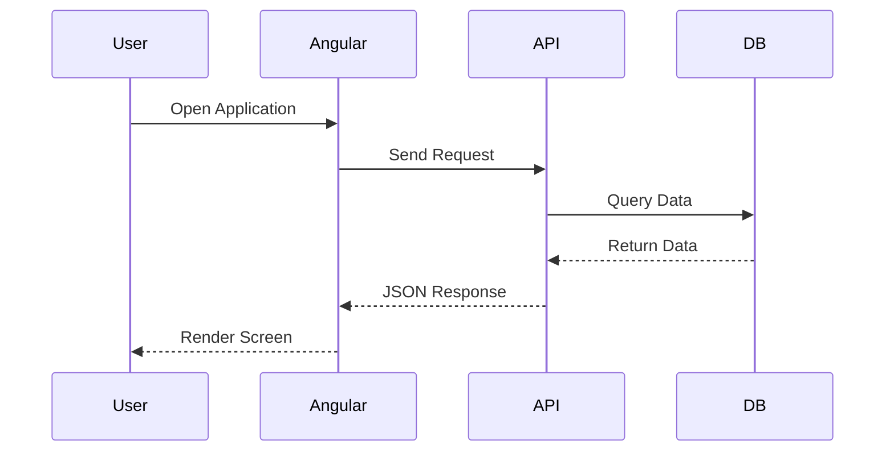
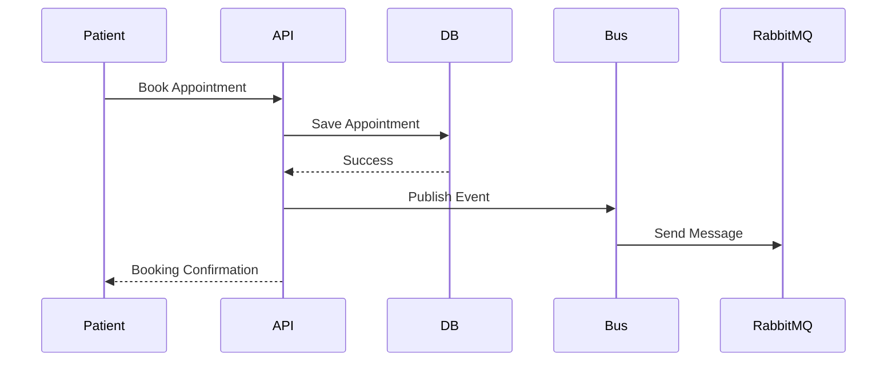
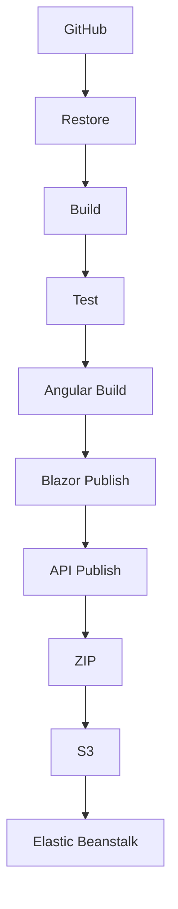

HEALTHAXIS
====================================================================
Enterprise Clinic & Appointment Management Platform
====================================================================

# HealthAxis

.NET 10 | Angular | Blazor WebAssembly | SQL Server | RabbitMQ | AWS Elastic Beanstalk | Jenkins

--------------------------------------------------------------------
PROJECT OVERVIEW
--------------------------------------------------------------------

HealthAxis is a comprehensive healthcare appointment and clinic management platform built to demonstrate how a modern enterprise application can be designed, developed, deployed, and maintained using contemporary Microsoft and cloud technologies.

The platform supports patients, doctors, and administrators through separate user experiences while sharing a common backend API. The system provides secure authentication, appointment scheduling, doctor management, health record tracking, messaging-based integration, automated testing, and cloud deployment.

Unlike a basic tutorial application, HealthAxis was designed to resemble a real-world software delivery project. It includes authentication, authorization, database integration, asynchronous messaging, CI/CD automation, health monitoring, deployment validation, and infrastructure-aware design.

====================================================================
LIVE ENVIRONMENT
====================================================================

+----------------------+--------------------------------------------------------------------------------+
| Area                 | URL                                                                            |
+----------------------+--------------------------------------------------------------------------------+
| Angular App          | http://healthaxis-v2-dev.eba-pbcv4if3.ap-south-1.elasticbeanstalk.com/Angular/ |
| API Base URL         | http://healthaxis-v2-dev.eba-pbcv4if3.ap-south-1.elasticbeanstalk.com          |
| Health Check         | http://healthaxis-v2-dev.eba-pbcv4if3.ap-south-1.elasticbeanstalk.com/health   |
| Readiness Check      | http://healthaxis-v2-dev.eba-pbcv4if3.ap-south-1.elasticbeanstalk.com/health/ready |
+----------------------+--------------------------------------------------------------------------------+

====================================================================
SCREENSHOTS
====================================================================

Folder:

docs/screenshots/

Expected Files:

docs/screenshots/healthaxis-landing.png
docs/screenshots/angular-login.png
docs/screenshots/angular-register.png
docs/screenshots/patient-dashboard.png
docs/screenshots/patient-appointments.png
docs/screenshots/patient-history.png
docs/screenshots/doctor-dashboard.png
docs/screenshots/blazor-admin.png

====================================================================
TABLE OF CONTENTS
====================================================================

1. Project Vision
2. Business Objectives
3. Key Features
4. System Architecture
5. Technology Stack
6. Request Flow
7. Appointment Processing Flow
8. Frontend Hosting Strategy
9. Repository Structure
10. Local Setup Guide
11. Database Configuration
12. Environment Variables
13. Build & Deployment
14. AWS Infrastructure
15. Jenkins Pipeline
16. API Reference
17. Troubleshooting
18. Security Considerations
19. Future Enhancements
20. License

====================================================================
PROJECT VISION
====================================================================

Healthcare organizations often struggle with manual appointment tracking, fragmented medical records, and inefficient communication between stakeholders.

HealthAxis aims to simplify these workflows by providing:

- Centralized appointment scheduling
- Doctor availability management
- Patient profile management
- Health record association with appointments
- Administrative oversight through a dedicated portal
- Secure role-based access control
- Reliable backend services with monitoring support

====================================================================
KEY FEATURES
====================================================================

AUTHENTICATION

- JWT-based authentication
- Role-based authorization
- Secure API access
- Protected application routes

PATIENT FEATURES

- Registration and login
- Dashboard experience
- Appointment scheduling
- Appointment history review
- Health record access
- Doctor browsing

DOCTOR FEATURES

- Doctor dashboard
- Schedule management
- Appointment visibility
- Patient interaction workflows

ADMIN FEATURES

- Dedicated Blazor WebAssembly application
- Administrative workflows separated from patient features
- Independent user experience

MESSAGING

- RabbitMQ integration
- MassTransit implementation
- Async appointment event publishing
- appointment-booked-queue messaging

MONITORING

- Liveness endpoint
- Readiness endpoint
- Infrastructure validation

====================================================================
SYSTEM ARCHITECTURE
====================================================================

MERMAID DIAGRAM

```mermaid
flowchart LR
    Browser[Browser] --> Angular[Angular SPA /Angular/]
    Browser --> Blazor[Blazor WASM /Blazor/]

    Angular --> API[ASP.NET Core API]
    Blazor --> API

    API --> SQL[(SQL Server)]
    API --> MT[MassTransit]
    MT --> Rabbit[(RabbitMQ)]

    API --> Health[/health and /health/ready]
```

====================================================================
TECHNOLOGY STACK
====================================================================

Backend
- .NET 10
- ASP.NET Core Web API
- Entity Framework Core
- SQL Server
- JWT Authentication
- Serilog
- Global Exception Handling

Frontend
- Angular
- TypeScript
- Bootstrap
- Blazor WebAssembly

Messaging
- RabbitMQ
- MassTransit

DevOps
- Jenkins
- AWS Elastic Beanstalk
- Amazon S3
- GitHub

Testing
- S4_HealthAxis.Tests
- Automated Unit Testing

====================================================================
REQUEST FLOW
====================================================================



====================================================================
APPOINTMENT BOOKING FLOW
====================================================================



appointment-booked-queue is used for publishing appointment-related events.

====================================================================
FRONTEND HOSTING STRATEGY
====================================================================

The API hosts both frontend applications.

Routing Structure

/Angular/          Angular Application
/Blazor/           Blazor WebAssembly Application
/api/*             REST API Endpoints
/health            Liveness Endpoint
/health/ready      Readiness Endpoint

Fallback Configuration

app.MapFallbackToFile("/Angular/{*path:nonfile}", "Angular/index.html");
app.MapFallbackToFile("/Blazor/{*path:nonfile}", "Blazor/index.html");

====================================================================
REPOSITORY STRUCTURE
====================================================================

HealthAxis/
│
├── S4_HealthAxis.slnx
├── S4_HealthAxisApi/
│   └── wwwroot/
│       ├── Angular/
│       └── Blazor/
├── S4_HealthAxis.Angular/
├── S4_HealthAxis.Blazor/
├── S4_HealthAxis.Shared/
├── S4_HealthAxis.Tests/
├── docs/
└── Jenkinsfile

====================================================================
LOCAL DEVELOPMENT SETUP
====================================================================

Prerequisites

- .NET 10 SDK
- Node.js
- npm
- SQL Server
- RabbitMQ
- Git
- AWS CLI (optional)
- Jenkins (optional)

Clone Repository

https://github.com/<your-user-or-org>/<your-repo>.git

Restore Solution

 dotnet restore .\S4_HealthAxis.slnx

Install Angular Packages

 cd .\S4_HealthAxis.Angular
 npm ci

Required Configuration Sections

ConnectionStrings:Default
JwtSettings
RabbitMq
Cors
ElasticSearch

Database Migration

 dotnet ef database update --project .\S4_HealthAxisApi\S4_HealthAxisApi.csproj

Build Solution

 dotnet build .\S4_HealthAxis.slnx -c Release

Run Tests

 dotnet test .\S4_HealthAxis.slnx -c Release

Run API

 dotnet run --project .\S4_HealthAxisApi\S4_HealthAxisApi.csproj

====================================================================
DATABASE CONFIGURATION
====================================================================

Connection Key

ConnectionStrings__Default

Infrastructure Endpoints

SQL Server : 10.20.13.213:1433
RabbitMQ   : 10.20.13.213:5672

====================================================================
ENVIRONMENT VARIABLES
====================================================================

ASPNETCORE_ENVIRONMENT
ASPNETCORE_URLS
ConnectionStrings__Default
JwtSettings__Secret
JwtSettings__Issuer
JwtSettings__Audience
RabbitMq__Host
RabbitMq__Port
RabbitMq__Username
RabbitMq__Password
RabbitMq__VirtualHost
RabbitMq__UseSsl
RabbitMq__AppointmentQueue
Cors__AllowedOrigins__0
ElasticSearch__Enabled

====================================================================
BUILD AND PUBLISH
====================================================================

1. Restore dependencies
2. Build solution
3. Execute tests
4. Build Angular
5. Publish Blazor
6. Publish API
7. Package deployment files

Angular Output

S4_HealthAxisApi\wwwroot\Angular

Blazor Output

S4_HealthAxisApi\wwwroot\Blazor

====================================================================
AWS ELASTIC BEANSTALK
====================================================================

Region
ap-south-1

Application
healthaxis-v2

Environment
healthaxis-v2-dev

URL
http://healthaxis-v2-dev.eba-pbcv4if3.ap-south-1.elasticbeanstalk.com

S3 Bucket
healthaxis-db-script-bucket

Network Requirements

SQL Server : 10.20.13.213:1433
RabbitMQ   : 10.20.13.213:5672

====================================================================
JENKINS PIPELINE
====================================================================

Pipeline Flow



Environment Values

AWS_REGION=ap-south-1
EB_APPLICATION_NAME=healthaxis-v2
EB_ENVIRONMENT_NAME=healthaxis-v2-dev
S3_BUCKET=healthaxis-db-script-bucket

====================================================================
API ENDPOINTS
====================================================================

+--------+-------------------------------------------+
| Method | Endpoint                                  |
+--------+-------------------------------------------+
| POST   | /api/auth/login                           |
| GET    | /api/patients/{id}                        |
| GET    | /api/appointments/patient/{patientId}     |
| GET    | /health                                   |
| GET    | /health/ready                             |
+--------+-------------------------------------------+

====================================================================
TROUBLESHOOTING
====================================================================

Health Endpoint Healthy But Readiness Fails

- Verify SQL Server connectivity.
- Verify RabbitMQ connectivity.
- Check VPC configuration.
- Review security-group access.
- Validate environment variables.

RabbitMQ Unreachable

- Confirm service availability.
- Confirm Port 5672 access.
- Verify RabbitMq__Host.
- Verify RabbitMq__Port.

Blazor Routing Issues

- Confirm index.html exists.
- Confirm _framework is available.
- Confirm /Blazor/ base path.

====================================================================
SECURITY CONSIDERATIONS
====================================================================

- Do not commit secrets.
- Store AWS credentials in Jenkins Credentials.
- Restrict SQL Server network access.
- Restrict RabbitMQ network access.
- Protect JWT signing secrets.
- Enable HTTPS for production deployments.
- Rotate credentials regularly.

====================================================================
ROADMAP
====================================================================

- AWS Secrets Manager integration
- HTTPS and custom domain support
- Automated migrations
- Blue/Green deployment model
- Monitoring dashboards
- Alerting framework
- Containerization support
- Expanded Blazor administration module
- End-to-end automated testing
- Mobile experience improvements

====================================================================
LICENSE
====================================================================

Copyright (c) 2026.
All rights reserved unless a LICENSE file states otherwise.
