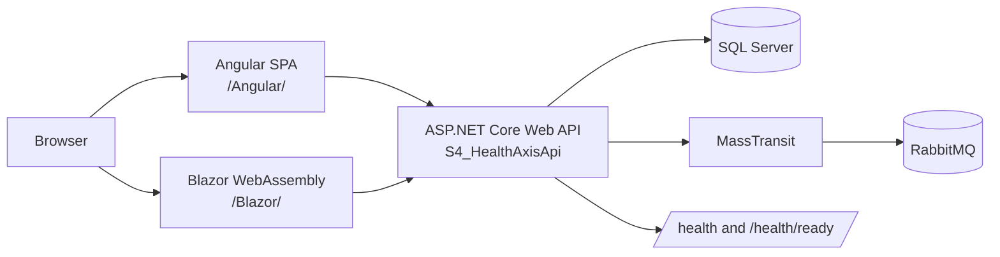
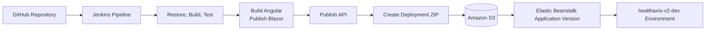
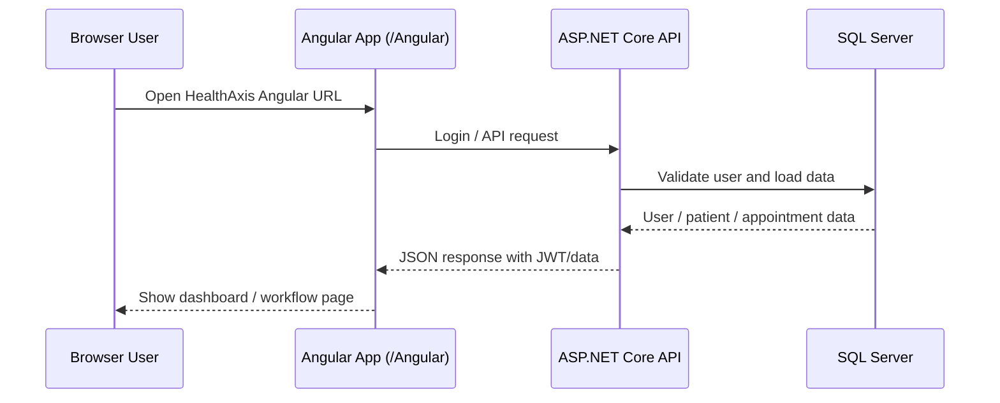
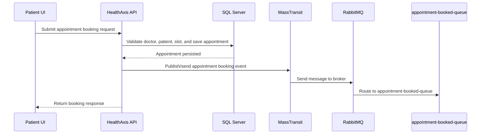
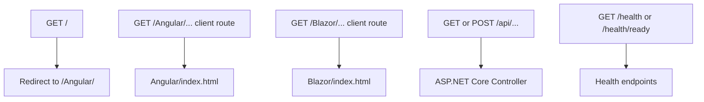
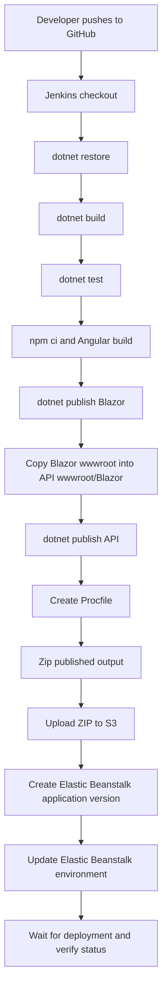

# HealthAxis


**HealthAxis** is a full-stack clinic and healthcare appointment management system built with ASP.NET Core, Angular, Blazor WebAssembly, SQL Server, RabbitMQ, MassTransit, AWS Elastic Beanstalk, and Jenkins CI/CD.

The application supports patient registration, patient login, doctor workflows, appointment booking, patient history, doctor schedules, health records, admin-oriented Blazor workflows, JWT authentication, SQL Server persistence, RabbitMQ messaging, automated tests, AWS deployment, and CI/CD automation.

---

## Live Project URLs

| Area | URL |
|---|---|
| Angular App | [http://healthaxis-v2-dev.eba-pbcv4if3.ap-south-1.elasticbeanstalk.com/Angular/](http://healthaxis-v2-dev.eba-pbcv4if3.ap-south-1.elasticbeanstalk.com/Angular/) |
| API Base URL | [http://healthaxis-v2-dev.eba-pbcv4if3.ap-south-1.elasticbeanstalk.com](http://healthaxis-v2-dev.eba-pbcv4if3.ap-south-1.elasticbeanstalk.com) |
| API Swagger Page | [http://healthaxis-v2-dev.eba-pbcv4if3.ap-south-1.elasticbeanstalk.com/swagger](http://healthaxis-v2-dev.eba-pbcv4if3.ap-south-1.elasticbeanstalk.com/swagger) |
| Health Check | [http://healthaxis-v2-dev.eba-pbcv4if3.ap-south-1.elasticbeanstalk.com/health](http://healthaxis-v2-dev.eba-pbcv4if3.ap-south-1.elasticbeanstalk.com/health) |
| Readiness Check | [http://healthaxis-v2-dev.eba-pbcv4if3.ap-south-1.elasticbeanstalk.com/health/ready](http://healthaxis-v2-dev.eba-pbcv4if3.ap-south-1.elasticbeanstalk.com/health/ready) |

> **Note:** Swagger availability may depend on whether Swagger/OpenAPI is enabled in the current deployment environment.

---

## Screenshots

Add screenshots to the following folder:

```text
docs/screenshots/
```

Recommended screenshot files:

```text
docs/screenshots/healthaxis-landing.png
docs/screenshots/angular-login.png
docs/screenshots/angular-register.png
docs/screenshots/patient-dashboard.png
docs/screenshots/patient-appointments.png
docs/screenshots/patient-history.png
docs/screenshots/doctor-dashboard.png
docs/screenshots/blazor-admin.png
```

Example screenshot references:

### Landing Page


### Login Page


### Registration Page


### Patient Dashboard


### Patient Appointments


### Patient History


### Doctor Dashboard


### Blazor Admin Workflow


> If a screenshot is not available yet, keep the placeholder path and add the image later.

---

## Table of Contents

- [Project Overview](#project-overview)
- [Problem Statement](#problem-statement)
- [Feature List](#feature-list)
- [Architecture Overview](#architecture-overview)
- [Application Flow](#application-flow)
- [Appointment Booking Message Flow](#appointment-booking-message-flow)
- [Static Hosting Flow](#static-hosting-flow)
- [CI/CD and AWS Publish Flow](#cicd-and-aws-publish-flow)
- [Repository Structure](#repository-structure)
- [Technology Stack](#technology-stack)
- [Prerequisites](#prerequisites)
- [Local Setup and Run Instructions](#local-setup-and-run-instructions)
- [Database Setup and Migration Command](#database-setup-and-migration-command)
- [Environment Variable Reference](#environment-variable-reference)
- [Running Tests](#running-tests)
- [Build and Publish Instructions](#build-and-publish-instructions)
- [Static Hosting Notes for Angular and Blazor](#static-hosting-notes-for-angular-and-blazor)
- [AWS Elastic Beanstalk Deployment Notes](#aws-elastic-beanstalk-deployment-notes)
- [Jenkins CI/CD Pipeline Overview](#jenkins-cicd-pipeline-overview)
- [Representative API Endpoints](#representative-api-endpoints)
- [Troubleshooting](#troubleshooting)
- [Security Notes](#security-notes)
- [Future Improvements](#future-improvements)
- [What You May Need to Change](#what-you-may-need-to-change)
- [License and Ownership](#license-and-ownership)

---

## Project Overview

HealthAxis is a multi-project healthcare appointment management application designed to digitize common clinic workflows. It combines a backend API, Angular frontend, Blazor WebAssembly frontend, shared DTO/contracts project, automated tests, SQL Server persistence, RabbitMQ messaging, AWS deployment, and Jenkins CI/CD automation.

The application is centered around the `S4_HealthAxisApi` project. This API project serves backend endpoints and also hosts the compiled Angular and Blazor static files:

```text
/Angular/ -> Angular frontend
/Blazor/  -> Blazor WebAssembly frontend
/api/...  -> ASP.NET Core Web API endpoints
/health   -> liveness endpoint
/health/ready -> readiness endpoint
```

This deployment approach allows HealthAxis to be deployed as a single AWS Elastic Beanstalk application while still keeping Angular, Blazor, API, shared contracts, and tests separated in the source code.

---

## Problem Statement

Clinic and healthcare appointment workflows often involve manual scheduling, fragmented patient and doctor coordination, limited appointment visibility, and disconnected administrative workflows. These problems can reduce operational efficiency and make it harder to track patient history and upcoming care.

HealthAxis addresses this by providing a digital workflow for:

- Patient registration and login.
- Doctor and patient dashboards.
- Appointment booking.
- Patient appointment history.
- Doctor schedules.
- Health record/history association.
- Admin-oriented Blazor workflows.
- Reliable persistence through SQL Server.
- Asynchronous event processing through RabbitMQ and MassTransit.
- Cloud deployment through AWS Elastic Beanstalk.
- Automated CI/CD through Jenkins.

---

## Feature List

### Authentication and Authorization

- JWT-based authentication.
- Role-based authorization.
- Login endpoint for authenticated users.
- Token-driven access for protected API endpoints.

### Patient Workflows

- Patient registration.
- Patient login.
- Patient dashboard.
- Patient profile retrieval.
- Patient appointment history.
- Patient doctor listing and booking workflows.

### Doctor Workflows

- Doctor-facing workflows.
- Doctor schedule support.
- Doctor dashboard and patient-related views through the Angular application.

### Appointment Management

- Appointment booking.
- Appointment history retrieval by patient.
- Appointment association with doctor and patient records.
- Appointment-related message flow through RabbitMQ/MassTransit.

### Health Records and History

- Health record/history association with appointments.
- Patient history views backed by API data.

### Admin-Oriented Blazor Workflows

- Blazor WebAssembly frontend served under `/Blazor/`.
- Admin-oriented workflows through a separate frontend client.

### Messaging

- RabbitMQ broker integration.
- MassTransit messaging abstraction.
- Appointment queue: `appointment-booked-queue`.

### Service Health

- `/health` liveness endpoint.
- `/health/ready` readiness endpoint.

### DevOps and Deployment

- AWS Elastic Beanstalk deployment.
- S3-hosted deployment bundles.
- Jenkins CI/CD pipeline.
- GitHub source control.

---

## Architecture Overview



High-level deployment architecture:



---

## Application Flow



---

## Appointment Booking Message Flow



---

## Static Hosting Flow



The API project must include SPA fallback routes:

```csharp
app.MapFallbackToFile("/Angular/{*path:nonfile}", "Angular/index.html");
app.MapFallbackToFile("/Blazor/{*path:nonfile}", "Blazor/index.html");
```

---

## CI/CD and AWS Publish Flow



---

## Repository Structure

```text
HealthAxis/
│
├── S4_HealthAxis.slnx
│   Main solution file.
│
├── S4_HealthAxisApi/
│   ASP.NET Core Web API project and deployment host.
│   Contains controllers, authentication, EF Core access, messaging setup,
│   health checks, static frontend hosting, and deployment configuration.
│
│   └── wwwroot/
│       ├── Angular/
│       │   Angular production build output served under /Angular/.
│       │
│       └── Blazor/
│           Blazor WebAssembly publish output served under /Blazor/.
│
├── S4_HealthAxis.Angular/
│   Angular frontend for landing, login, registration, patient, doctor,
│   dashboard, and appointment workflows.
│
├── S4_HealthAxis.Blazor/
│   Blazor WebAssembly frontend for admin-oriented workflows.
│
├── S4_HealthAxis.Shared/
│   Shared DTOs, common models, and cross-project contracts.
│
├── S4_HealthAxis.Tests/
│   Automated test project.
│
├── docs/
│   Optional documentation and screenshots.
│
└── Jenkinsfile
    Jenkins CI/CD pipeline definition.
```

---

## Technology Stack

### Backend

- .NET 10
- ASP.NET Core Web API
- Entity Framework Core
- SQL Server
- JWT authentication
- Role-based authorization
- Serilog logging
- Global exception handling
- Health and readiness endpoints

### Frontend

- Angular
- TypeScript
- Bootstrap
- Bootstrap Icons
- Blazor WebAssembly

### Messaging

- RabbitMQ
- MassTransit
- Queue: `appointment-booked-queue`

### Cloud and DevOps

- AWS Elastic Beanstalk on Linux
- NGINX reverse proxy on Elastic Beanstalk
- Amazon S3 for deployment bundles
- Jenkins CI/CD
- GitHub source control

### Testing

- `S4_HealthAxis.Tests`
- `dotnet test`

---

## Prerequisites

Install the following before running locally:

- .NET 10 SDK
- Node.js and npm
- SQL Server
- RabbitMQ
- Git
- AWS CLI, if deploying manually
- Jenkins, if running the CI/CD pipeline locally or on a build server

Verify tooling:

```powershell
dotnet --info
node --version
npm --version
git --version
aws --version
```

---

## Local Setup and Run Instructions

### 1. Clone the Repository

```powershell
git clone https://github.com/<your-user-or-org>/<your-repo>.git
cd <your-repo>
```

> Replace the repository URL with the actual HealthAxis GitHub repository URL.

### 2. Restore .NET Dependencies

```powershell
dotnet restore .\S4_HealthAxis.slnx
```

### 3. Install Angular Dependencies

```powershell
cd .\S4_HealthAxis.Angular
npm ci
cd ..
```

### 4. Configure Local Settings

Configure the API through one of the following:

- `appsettings.Development.json`
- .NET user secrets
- Environment variables

Required configuration areas:

```text
ConnectionStrings:Default
JwtSettings
RabbitMq
Cors
ElasticSearch
```

Do not commit real secrets.

### 5. Ensure SQL Server and RabbitMQ Are Running

The API requires SQL Server and RabbitMQ to be reachable.

For AWS deployment, the known private infrastructure endpoint is:

```text
SQL Server: 10.20.13.213:1433
RabbitMQ:   10.20.13.213:5672
```

For local development, use local SQL Server/RabbitMQ instances or project-specific tunnel configuration.

### 6. Apply Database Migrations or Initialize Database

Install EF tooling if required:

```powershell
dotnet tool install --global dotnet-ef
```

Apply migrations:

```powershell
dotnet ef database update --project .\S4_HealthAxisApi\S4_HealthAxisApi.csproj
```

If migrations are stored in another project or if the solution requires a startup project parameter, adapt the command accordingly.

### 7. Build the Solution

```powershell
dotnet build .\S4_HealthAxis.slnx -c Release
```

### 8. Run Tests

```powershell
dotnet test .\S4_HealthAxis.slnx -c Release
```

### 9. Start the API

```powershell
dotnet run --project .\S4_HealthAxisApi\S4_HealthAxisApi.csproj
```

### 10. Build Angular Static Output

```powershell
cd .\S4_HealthAxis.Angular
npm run build
cd ..
```

The Angular output should be available under:

```text
S4_HealthAxisApi\wwwroot\Angular
```

### 11. Publish and Copy Blazor Static Output

```powershell
Remove-Item .\blazor-publish-temp -Recurse -Force -ErrorAction SilentlyContinue
Remove-Item .\S4_HealthAxisApi\wwwroot\Blazor -Recurse -Force -ErrorAction SilentlyContinue

dotnet publish .\S4_HealthAxis.Blazor\S4_HealthAxis.Blazor.csproj `
  -c Release `
  -o .\blazor-publish-temp

New-Item -ItemType Directory -Path .\S4_HealthAxisApi\wwwroot\Blazor -Force

Copy-Item .\blazor-publish-temp\wwwroot\* `
  .\S4_HealthAxisApi\wwwroot\Blazor `
  -Recurse `
  -Force
```

Verify:

```powershell
Test-Path .\S4_HealthAxisApi\wwwroot\Blazor\index.html
Test-Path .\S4_HealthAxisApi\wwwroot\Blazor\_framework
```

Both commands should return:

```text
True
```

### 12. Access the Application Locally

Depending on the configured local URL, use:

```text
/Angular/
/Blazor/
/api/...
/health
/health/ready
/swagger
```

Swagger availability may depend on environment-specific API configuration.

---

## Database Setup and Migration Command

HealthAxis uses SQL Server through Entity Framework Core.

The main connection string key is:

```text
ConnectionStrings__Default
```

This maps to:

```text
ConnectionStrings:Default
```

Migration command:

```powershell
dotnet ef database update --project .\S4_HealthAxisApi\S4_HealthAxisApi.csproj
```

If the project uses a separate migrations assembly or startup project, update the command as needed.

Example with startup project:

```powershell
dotnet ef database update `
  --project .\S4_HealthAxisApi\S4_HealthAxisApi.csproj `
  --startup-project .\S4_HealthAxisApi\S4_HealthAxisApi.csproj
```

---

## Environment Variable Reference

> Do not commit secrets. Use local user secrets, Jenkins credentials, Elastic Beanstalk environment properties, or a managed secret store.

| Name | Description | Example Value |
|---|---|---|
| `ASPNETCORE_ENVIRONMENT` | ASP.NET Core runtime environment. | `Production` |
| `ASPNETCORE_URLS` | ASP.NET Core listening URL used by Elastic Beanstalk/NGINX. | `http://+:5000` |
| `ConnectionStrings__Default` | SQL Server connection string. Maps to `ConnectionStrings:Default`. | `Server=10.20.13.213,1433;Database=HealthAxisDb;User Id=healthaxis_app;Password=<password>;Encrypt=True;TrustServerCertificate=True;Connect Timeout=30;MultipleActiveResultSets=True;` |
| `JwtSettings__Secret` | JWT signing secret. | `<long-random-secret>` |
| `JwtSettings__Issuer` | JWT token issuer. | `HealthAxis` |
| `JwtSettings__Audience` | JWT token audience. | `HealthAxisUsers` |
| `RabbitMq__Host` | RabbitMQ host or private IP. | `10.20.13.213` |
| `RabbitMq__Port` | RabbitMQ AMQP port. | `5672` |
| `RabbitMq__Username` | RabbitMQ username. | `<rabbitmq-user>` |
| `RabbitMq__Password` | RabbitMQ password. | `<rabbitmq-password>` |
| `RabbitMq__VirtualHost` | RabbitMQ virtual host. | `/` |
| `RabbitMq__UseSsl` | Determines whether RabbitMQ SSL is enabled. | `false` |
| `RabbitMq__AppointmentQueue` | Queue used for appointment-related messages. | `appointment-booked-queue` |
| `Cors__AllowedOrigins__0` | Allowed browser origin for CORS. | `http://healthaxis-v2-dev.eba-pbcv4if3.ap-south-1.elasticbeanstalk.com` |
| `ElasticSearch__Enabled` | Enables or disables Elasticsearch integration. | `false` |

---

## Running Tests

The test project is:

```text
S4_HealthAxis.Tests
```

Known test suite result:

```text
355 tests passed
```

Run tests:

```powershell
dotnet test .\S4_HealthAxis.slnx -c Release
```

---

## Build and Publish Instructions

### Restore

```powershell
dotnet restore .\S4_HealthAxis.slnx
```

### Build

```powershell
dotnet build .\S4_HealthAxis.slnx -c Release --no-restore
```

### Test

```powershell
dotnet test .\S4_HealthAxis.slnx -c Release --no-build
```

### Build Angular

```powershell
cd .\S4_HealthAxis.Angular
npm ci
npm run build
cd ..
```

### Publish Blazor and Copy Output

```powershell
Remove-Item .\blazor-publish-temp -Recurse -Force -ErrorAction SilentlyContinue
Remove-Item .\S4_HealthAxisApi\wwwroot\Blazor -Recurse -Force -ErrorAction SilentlyContinue

dotnet publish .\S4_HealthAxis.Blazor\S4_HealthAxis.Blazor.csproj `
  -c Release `
  -o .\blazor-publish-temp

New-Item -ItemType Directory -Path .\S4_HealthAxisApi\wwwroot\Blazor -Force

Copy-Item .\blazor-publish-temp\wwwroot\* `
  .\S4_HealthAxisApi\wwwroot\Blazor `
  -Recurse `
  -Force
```

### Publish API

```powershell
dotnet publish .\S4_HealthAxisApi\S4_HealthAxisApi.csproj `
  -c Release `
  -o .\publish
```

For Linux self-contained deployment, if required:

```powershell
dotnet publish .\S4_HealthAxisApi\S4_HealthAxisApi.csproj `
  -c Release `
  -r linux-x64 `
  --self-contained true `
  -o .\publish
```

---

## Static Hosting Notes for Angular and Blazor

The API project hosts the frontend applications from `wwwroot`.

Required behavior:

```text
/          -> redirects to /Angular/
/Angular/ -> Angular frontend
/Blazor/  -> Blazor WebAssembly frontend
```

Required fallback routes in `S4_HealthAxisApi/Program.cs`:

```csharp
app.MapFallbackToFile("/Angular/{*path:nonfile}", "Angular/index.html");
app.MapFallbackToFile("/Blazor/{*path:nonfile}", "Blazor/index.html");
```

Blazor requirement:

```html
<base href="/Blazor/" />
```

or equivalent base href configuration inside:

```text
S4_HealthAxis.Blazor/wwwroot/index.html
```

Correct deployed Blazor output:

```text
S4_HealthAxisApi/wwwroot/Blazor/index.html
S4_HealthAxisApi/wwwroot/Blazor/_framework
```

Incorrect nested output:

```text
S4_HealthAxisApi/wwwroot/Blazor/wwwroot/index.html
```

---

## AWS Elastic Beanstalk Deployment Notes

### Known Environment

```text
AWS region: ap-south-1
Elastic Beanstalk application: healthaxis-v2
Elastic Beanstalk environment: healthaxis-v2-dev
Elastic Beanstalk URL: http://healthaxis-v2-dev.eba-pbcv4if3.ap-south-1.elasticbeanstalk.com
S3 bucket: healthaxis-db-script-bucket
```

### Network Requirement

The deployed API expects to reach:

```text
SQL Server: 10.20.13.213:1433
RabbitMQ:   10.20.13.213:5672
```

Elastic Beanstalk must either:

- run in the same VPC as SQL Server/RabbitMQ, or
- have correct VPC peering, route tables, NACLs, and security group rules.

A previously resolved deployment issue was caused by Elastic Beanstalk being created in a different VPC from SQL Server/RabbitMQ. In that state, the application could start but readiness failed because RabbitMQ and/or SQL Server were unreachable over the private IP.

### Security Group Guidance

- Allow TCP `1433` from the Elastic Beanstalk security group to the SQL Server security group.
- Allow TCP `5672` from the Elastic Beanstalk security group to the RabbitMQ security group.
- Do not expose SQL Server or RabbitMQ publicly.

### Procfile

Framework-dependent example:

```text
web: dotnet S4_HealthAxisApi.dll
```

Self-contained Linux executable example:

```text
web: ./S4_HealthAxisApi
```

Use the format that matches the published bundle.

---

## Jenkins CI/CD Pipeline Overview

The Jenkins pipeline is expected to run on a Windows agent.

Pipeline responsibilities:

1. Checkout from GitHub.
2. Restore .NET dependencies.
3. Build the solution.
4. Run tests.
5. Build Angular.
6. Publish Blazor.
7. Copy Blazor `wwwroot` into `S4_HealthAxisApi/wwwroot/Blazor`.
8. Publish API.
9. Create `Procfile`.
10. Zip published output.
11. Upload ZIP to S3.
12. Create Elastic Beanstalk application version.
13. Update Elastic Beanstalk environment.
14. Wait for deployment.
15. Print deployment status.

Jenkins AWS credentials must be configured in Jenkins Credentials and must not be hardcoded in the repository.

Known deployment values:

```text
AWS_REGION=ap-south-1
EB_APPLICATION_NAME=healthaxis-v2
EB_ENVIRONMENT_NAME=healthaxis-v2-dev
S3_BUCKET=healthaxis-db-script-bucket
```

---

## Live URLs

### Angular App

```text
http://healthaxis-v2-dev.eba-pbcv4if3.ap-south-1.elasticbeanstalk.com/Angular/
```

### API Base URL

```text
http://healthaxis-v2-dev.eba-pbcv4if3.ap-south-1.elasticbeanstalk.com
```

### API Swagger Page

```text
http://healthaxis-v2-dev.eba-pbcv4if3.ap-south-1.elasticbeanstalk.com/swagger
```

Swagger availability may depend on whether Swagger/OpenAPI is enabled for the current deployment environment.

### Health Endpoints

```text
http://healthaxis-v2-dev.eba-pbcv4if3.ap-south-1.elasticbeanstalk.com/health
http://healthaxis-v2-dev.eba-pbcv4if3.ap-south-1.elasticbeanstalk.com/health/ready
```

---

## Representative API Endpoints

| Method | Endpoint | Purpose |
|---|---|---|
| `POST` | `/api/auth/login` | Authenticates a user and returns authentication response data. |
| `GET` | `/api/patients/{id}` | Retrieves patient details by ID. |
| `GET` | `/api/appointments/patient/{patientId}` | Retrieves appointment history for a patient. |
| `GET` | `/health` | Liveness check. |
| `GET` | `/health/ready` | Readiness check for infrastructure dependencies. |

This is a representative endpoint list, not a complete API specification.

---

## Screenshots

Add screenshots to a repository folder such as:

```text
docs/screenshots/
```

Suggested screenshots:

### Landing Page

```text
docs/screenshots/angular-landing.png
```

### Login Page

```text
docs/screenshots/angular-login.png
```

### Registration Page

```text
docs/screenshots/angular-register.png
```

### Patient Dashboard

```text
docs/screenshots/patient-dashboard.png
```

### Doctor Dashboard

```text
docs/screenshots/doctor-dashboard.png
```

### Blazor Admin Screen

```text
docs/screenshots/blazor-admin.png
```

Markdown example:

```md

```

---

## Troubleshooting

### `/health` Works but `/health/ready` Fails

Likely causes:

- SQL Server unreachable.
- RabbitMQ unreachable.
- Elastic Beanstalk is in the wrong VPC.
- Security group rules are missing.
- Environment variables are incorrect.

Check:

```text
ConnectionStrings__Default
RabbitMq__Host
RabbitMq__Port
Security group inbound rules
VPC/subnet placement
```

### RabbitMQ Unreachable

Symptoms may include:

```text
Broker unreachable
Connection failed, host 10.20.13.213:5672
```

Check:

- RabbitMQ service is running.
- Port `5672` is listening.
- `RabbitMq__Host` is correct.
- `RabbitMq__Port` is correct.
- Elastic Beanstalk can reach the RabbitMQ private IP.
- RabbitMQ security group allows inbound `5672` from Elastic Beanstalk.

### CORS Startup Failure

If the application fails at startup with CORS validation errors, check:

```text
Cors__AllowedOrigins__0
```

Correct example:

```text
http://healthaxis-v2-dev.eba-pbcv4if3.ap-south-1.elasticbeanstalk.com
```

Avoid:

```text
Quotes
Commas
Trailing slash
/Angular path
/Blazor path
HTML anchor text
```

### `/Blazor/login` Returns 404

Check:

- `Program.cs` contains the Blazor fallback route.
- `S4_HealthAxisApi/wwwroot/Blazor/index.html` exists.
- `S4_HealthAxisApi/wwwroot/Blazor/_framework` exists.
- Blazor `index.html` uses base href `/Blazor/`.
- Blazor output is not nested under `wwwroot/Blazor/wwwroot`.

### Angular Build Budget Failure in CI

If Angular fails due to CSS or bundle budget errors:

- Review `S4_HealthAxis.Angular/angular.json`.
- Increase budget thresholds if appropriate.
- Optimize oversized component CSS.
- Keep changes intentional and documented.

### Elastic Beanstalk Created in Wrong VPC

If Elastic Beanstalk cannot reach SQL Server or RabbitMQ using private IP `10.20.13.213`, verify the Elastic Beanstalk EC2 instance VPC.

Recommended fix:

- Create/recreate the Elastic Beanstalk environment in the VPC that can reach SQL Server/RabbitMQ.

Alternative:

- Configure VPC peering, route tables, network ACLs, and security groups correctly.

---

## Security Notes

- Do not commit secrets.
- Do not commit database passwords, RabbitMQ passwords, JWT secrets, or AWS credentials.
- Store AWS credentials in Jenkins Credentials.
- Store production runtime configuration in Elastic Beanstalk environment properties or a managed secret store.
- Restrict SQL Server and RabbitMQ inbound rules to Elastic Beanstalk security groups.
- Avoid public exposure of database and message broker ports.
- Rotate JWT, database, and RabbitMQ credentials if they are exposed in logs, screenshots, or chat.
- Consider HTTPS and a custom domain before production use.
- Consider AWS Secrets Manager or AWS Systems Manager Parameter Store for future secret management.

---

## Future Improvements

Potential improvements:

- Move secrets to AWS Secrets Manager or AWS Systems Manager Parameter Store.
- Add HTTPS and a custom domain.
- Automate database migrations in CI/CD.
- Add blue/green deployment.
- Add centralized observability dashboards.
- Add structured operational alerts.
- Containerize the application using Docker.
- Use a managed RabbitMQ service or Amazon MQ for production-grade messaging.
- Expand admin workflows.
- Add full API documentation and generated OpenAPI artifacts.
- Add end-to-end UI tests.
- Improve mobile browser responsiveness across all frontend pages.

---

## What You May Need to Change

Before committing this README to another environment, review and update the following values if they differ:

| Item | Current Value | When to Change |
|---|---|---|
| GitHub clone URL | `https://github.com/<your-user-or-org>/<your-repo>.git` | Replace with the actual repository URL. |
| Angular live URL | `http://healthaxis-v2-dev.eba-pbcv4if3.ap-south-1.elasticbeanstalk.com/Angular/` | Change if the EB CNAME or custom domain changes. |
| API base URL | `http://healthaxis-v2-dev.eba-pbcv4if3.ap-south-1.elasticbeanstalk.com` | Change if the EB CNAME or custom domain changes. |
| Swagger URL | `http://healthaxis-v2-dev.eba-pbcv4if3.ap-south-1.elasticbeanstalk.com/swagger` | Change if Swagger is moved or disabled in Production. |
| S3 bucket | `healthaxis-db-script-bucket` | Change if Jenkins deploys artifacts to a different bucket. |
| EB application name | `healthaxis-v2` | Change if the EB application name changes. |
| EB environment name | `healthaxis-v2-dev` | Change if deploying to staging/production. |
| SQL/RabbitMQ private IP | `10.20.13.213` | Change if infrastructure is moved. |
| Screenshot paths | `docs/screenshots/*.png` | Add actual screenshots and keep names aligned with README links. |
| Procfile command | `dotnet S4_HealthAxisApi.dll` or `./S4_HealthAxisApi` | Match the deployment type used by the published bundle. |

---

## License and Ownership

This project is intended for learning, demonstration, and portfolio/review purposes unless otherwise specified.

Add a license file before redistribution or production use.

```text
Copyright (c) 2026.
All rights reserved unless a LICENSE file states otherwise.
```
