# HealthAxis


Hey there! Welcome to **HealthAxis**. This is a full-stack clinic and healthcare appointment management system I put together to help digitize common medical workflows. It's built with ASP.NET Core, Angular, Blazor WebAssembly, SQL Server, RabbitMQ, MassTransit, AWS Elastic Beanstalk, and Jenkins for our CI/CD pipeline. 

The app handles the whole journey: patient registration, secure logins, doctor workflows, booking appointments, tracking patient history, and managing doctor schedules. It also includes an admin-focused Blazor interface. Under the hood, we're using JWT for authentication, SQL Server for data persistence, RabbitMQ for message queuing, and automated tests to keep things stable before pushing to AWS.

---

## Live Project URLs

Here’s where you can check out the live environments:

| Area | URL |
|---|---|
| Angular App | [http://healthaxis-v2-dev.eba-pbcv4if3.ap-south-1.elasticbeanstalk.com/Angular/](http://healthaxis-v2-dev.eba-pbcv4if3.ap-south-1.elasticbeanstalk.com/Angular/) |
| API Base URL | [http://healthaxis-v2-dev.eba-pbcv4if3.ap-south-1.elasticbeanstalk.com](http://healthaxis-v2-dev.eba-pbcv4if3.ap-south-1.elasticbeanstalk.com) |
| Health Check | [http://healthaxis-v2-dev.eba-pbcv4if3.ap-south-1.elasticbeanstalk.com/health](http://healthaxis-v2-dev.eba-pbcv4if3.ap-south-1.elasticbeanstalk.com/health) |
| Readiness Check | [http://healthaxis-v2-dev.eba-pbcv4if3.ap-south-1.elasticbeanstalk.com/health/ready](http://healthaxis-v2-dev.eba-pbcv4if3.ap-south-1.elasticbeanstalk.com/health/ready) |

---

## Screenshots

Visuals always help, so I've saved a few screenshots of the main views. If you're pulling this repo down, you can find them in:

`docs/screenshots/`

Here’s what we have so far:

### Landing Page
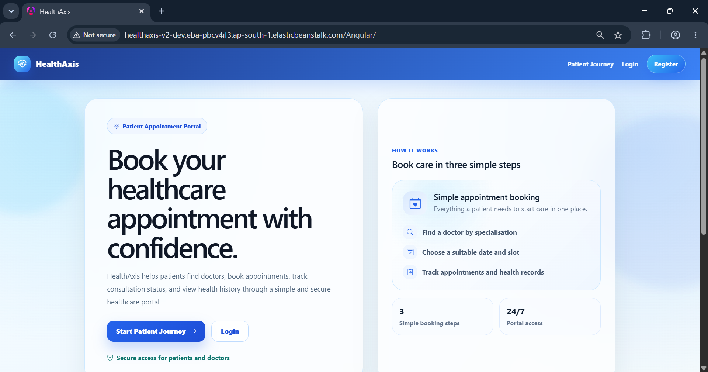

### Login Page
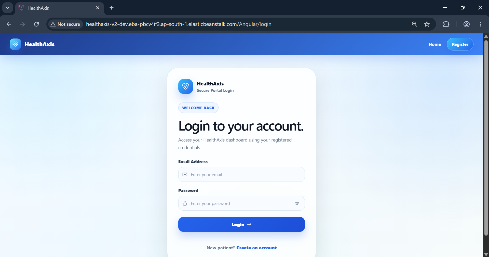

### Registration Page
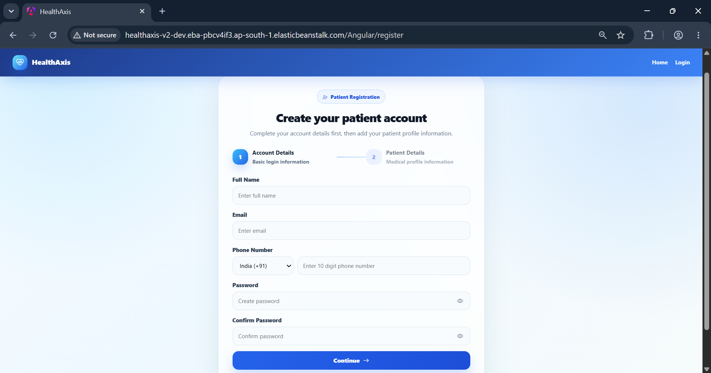

### Patient Dashboard
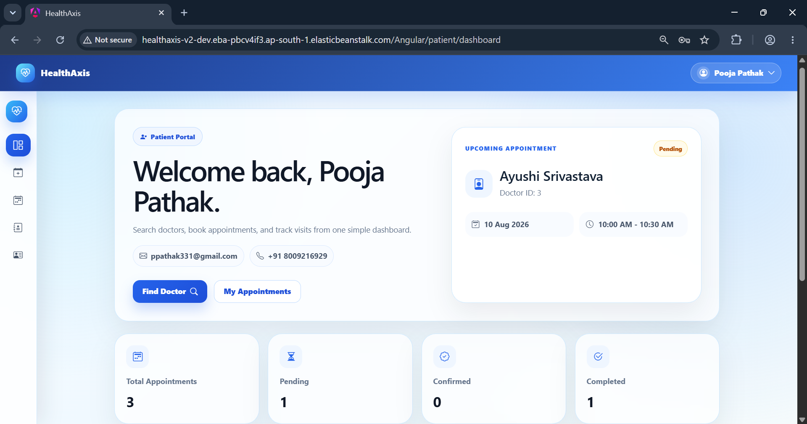

### Patient Appointments
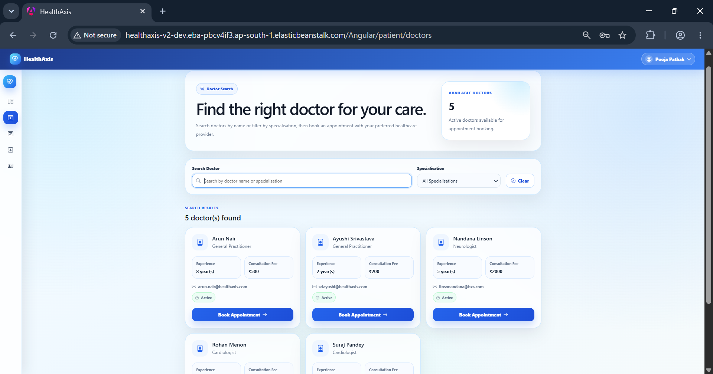

### Patient History
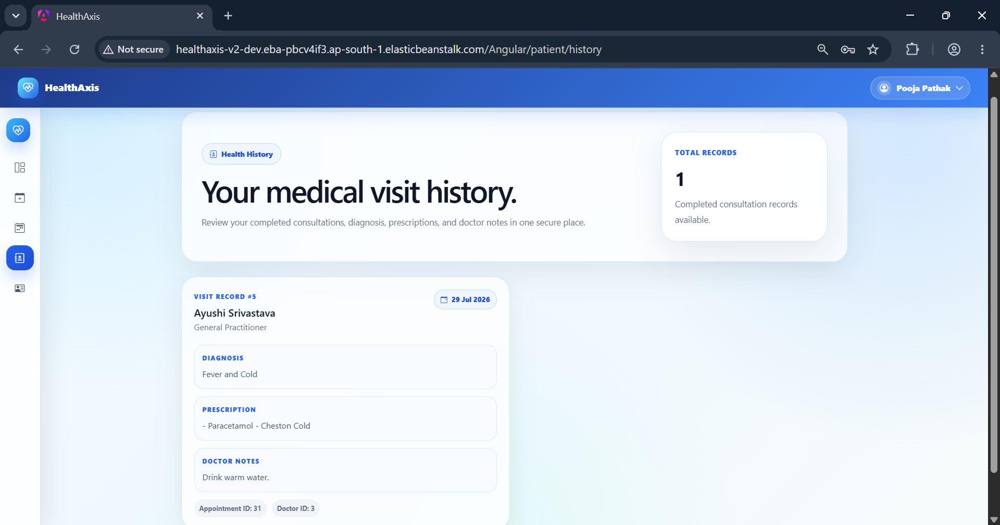

### Doctor Dashboard
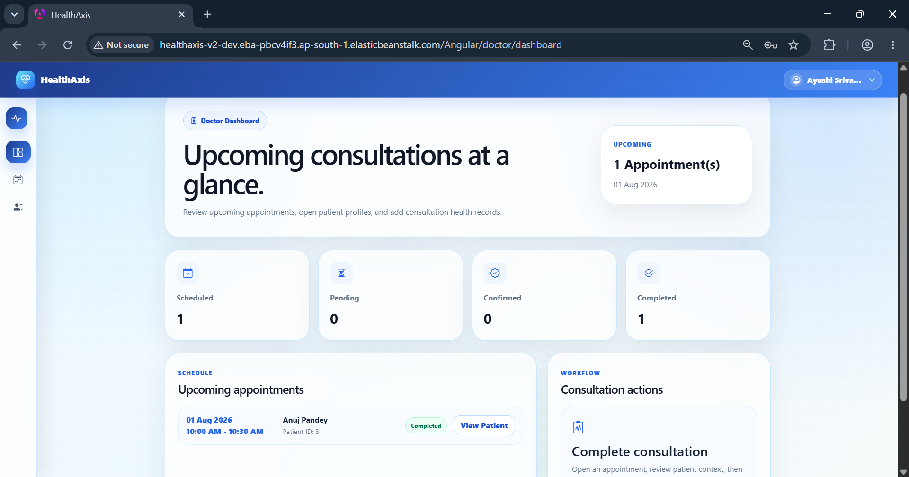

### Blazor Admin Workflow
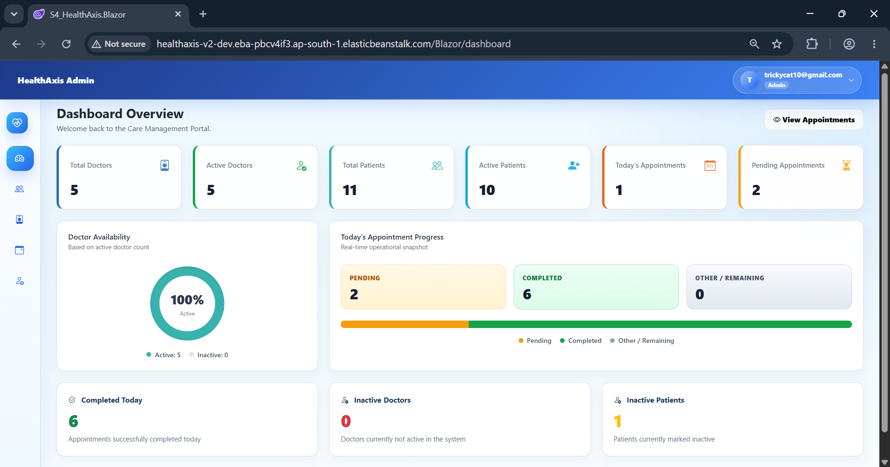


---

## Table of Contents

- [Project Overview](#project-overview)
- [Problem Statement](#problem-statement)
- [Feature List](#feature-list)
- [Architecture Overview](#architecture-overview)
- [Application Flow](#application-flow)
- [Appointment Booking Message Flow](#appointment-booking-message-flow)
- [Static Hosting Flow](#static-hosting-flow)
- [CI/CD and AWS Publish Flow](#cicd-and-aws-publish-flow)
- [Repository Structure](#repository-structure)
- [Technology Stack](#technology-stack)
- [Prerequisites](#prerequisites)
- [Local Setup and Run Instructions](#local-setup-and-run-instructions)
- [Database Setup and Migration Command](#database-setup-and-migration-command)
- [Environment Variable Reference](#environment-variable-reference)
- [Running Tests](#running-tests)
- [Build and Publish Instructions](#build-and-publish-instructions)
- [Static Hosting Notes for Angular and Blazor](#static-hosting-notes-for-angular-and-blazor)
- [AWS Elastic Beanstalk Deployment Notes](#aws-elastic-beanstalk-deployment-notes)
- [Jenkins CI/CD Pipeline Overview](#jenkins-cicd-pipeline-overview)
- [Representative API Endpoints](#representative-api-endpoints)
- [Troubleshooting](#troubleshooting)
- [Security Notes](#security-notes)
- [Future Improvements](#future-improvements)
- [What You May Need to Change](#what-you-may-need-to-change)
- [License and Ownership](#license-and-ownership)

---

## Project Overview

HealthAxis is a multi-project setup designed to digitize standard clinic operations. I wanted to build something that seamlessly combines a backend API, an Angular frontend for patients/doctors, and a Blazor WebAssembly frontend for admins, all while sharing DTOs and contracts cleanly.

The beating heart of this application is the `S4_HealthAxisApi` project. It doesn't just serve the backend endpoints; it also acts as the host for our compiled Angular and Blazor static files. The routing looks like this:

```text
/Angular/ -> Angular frontend
/Blazor/  -> Blazor WebAssembly frontend
/api/...  -> ASP.NET Core Web API endpoints
/health   -> liveness endpoint
/health/ready -> readiness endpoint
```

This structure is great because it lets us deploy HealthAxis as a single AWS Elastic Beanstalk app, keeping infrastructure simple while maintaining a clean separation of concerns in the source code.

---

## Problem Statement

Let's face it, a lot of clinic workflows are still stuck in the past. Manual scheduling, fragmented communication between doctors and patients, and disconnected admin tools make it hard to get a clear picture of a patient's history or upcoming care.

I built HealthAxis to tackle this head-on by offering:
- Seamless digital registration and logins.
- Dedicated dashboards tailored to both doctors and patients.
- Easy appointment booking and schedule management.
- Centralized patient history and health records.
- Solid admin tools through Blazor.
- Reliable data storage with SQL Server.
- Asynchronous processing via RabbitMQ so the app stays snappy.
- Automated deployments to the cloud so updates are painless.

---

## Feature List

### Authentication & Authorization
- Secure JWT-based logins.
- Role-based access control.
- Protected API endpoints that require valid tokens.

### Patient Experience
- Quick registration and login.
- A personalized dashboard.
- Easy access to profile details and appointment history.
- Intuitive workflows for browsing doctors and booking slots.

### Doctor Tools
- Custom views tailored for doctors.
- Schedule management.
- Quick insights into patient information via the Angular app.

### Appointment Management
- End-to-end booking functionality.
- Easy retrieval of past and future appointments.
- Linking appointments directly to specific doctors and patient records.
- Event-driven processing through RabbitMQ/MassTransit (using the `appointment-booked-queue`).

### Health Records
- Tying health histories directly to appointments.
- API-backed history views so patients can review their care timeline.

### Admin Tools
- A dedicated Blazor WebAssembly frontend served at `/Blazor/` specifically for admin tasks and management.

### Under the Hood
- RabbitMQ broker integration wrapped by MassTransit.
- Built-in `/health` and `/health/ready` endpoints to keep track of service uptime.
- Full CI/CD pipeline using GitHub, Jenkins, and AWS Elastic Beanstalk (with S3 for deployment bundles).

---

## Architecture Overview

Here's a bird's-eye view of how the pieces fit together:

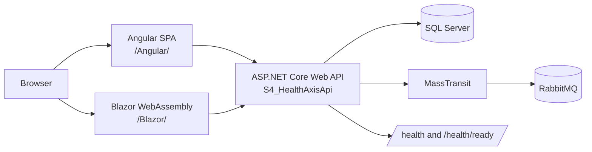

And here’s how we handle our automated deployments:

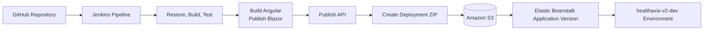

---

## Application Flow

Here is a standard user journey from logging in to viewing their dashboard:

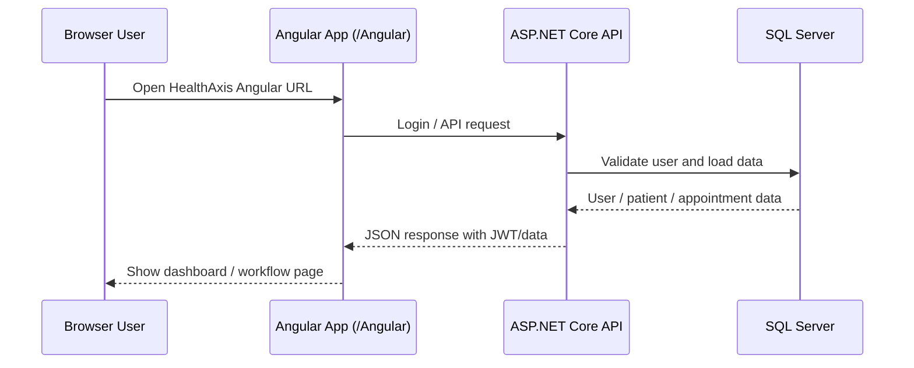

---

## Appointment Booking Message Flow

When a patient books an appointment, we handle it asynchronously to keep the UI responsive:

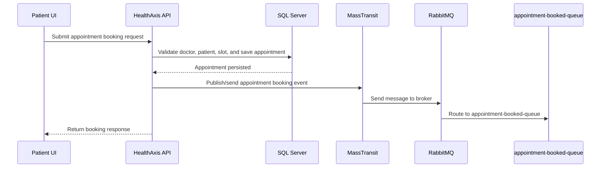

---

## Static Hosting Flow

To host everything on one server smoothly, we use fallback routes in ASP.NET:

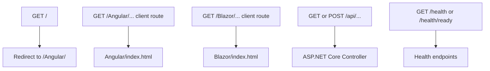

Make sure these fallback routes are active in the API project:
```csharp
app.MapFallbackToFile("/Angular/{*path:nonfile}", "Angular/index.html");
app.MapFallbackToFile("/Blazor/{*path:nonfile}", "Blazor/index.html");
```

---

## CI/CD and AWS Publish Flow

Our Jenkins pipeline takes care of everything from building to deploying:

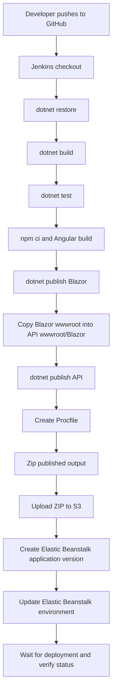

---

## Repository Structure

If you're digging into the code, here's how I organized things:

```text
HealthAxis/
│
├── S4_HealthAxis.slnx
│   Main solution file.
│
├── S4_HealthAxisApi/
│   ASP.NET Core Web API project and deployment host.
│   Contains controllers, authentication, EF Core access, messaging setup,
│   health checks, static frontend hosting, and deployment configuration.
│
│   └── wwwroot/
│       ├── Angular/
│       │   Angular production build output served under /Angular/.
│       │
│       └── Blazor/
│           Blazor WebAssembly publish output served under /Blazor/.
│
├── S4_HealthAxis.Angular/
│   Angular frontend for landing, login, registration, patient, doctor,
│   dashboard, and appointment workflows.
│
├── S4_HealthAxis.Blazor/
│   Blazor WebAssembly frontend for admin-oriented workflows.
│
├── S4_HealthAxis.Shared/
│   Shared DTOs, common models, and cross-project contracts.
│
├── S4_HealthAxis.Tests/
│   Automated test project.
│
├── docs/
│   Optional documentation and screenshots.
│
└── Jenkinsfile
    Jenkins CI/CD pipeline definition.
```

---

## Technology Stack

### Backend
- .NET 10
- ASP.NET Core Web API
- Entity Framework Core
- SQL Server
- JWT authentication
- Role-based authorization
- Serilog logging
- Global exception handling

### Frontend
- Angular
- TypeScript
- Bootstrap & Bootstrap Icons
- Blazor WebAssembly

### Messaging
- RabbitMQ
- MassTransit
- Queue: `appointment-booked-queue`

### Cloud and DevOps
- AWS Elastic Beanstalk on Linux
- NGINX reverse proxy on Elastic Beanstalk
- Amazon S3 for deployment bundles
- Jenkins CI/CD
- GitHub

### Testing
- `S4_HealthAxis.Tests` using `dotnet test`

---

## Prerequisites

Before you clone the repo and start hacking, you'll need a few things installed:

- .NET 10 SDK
- Node.js and npm
- SQL Server
- RabbitMQ
- Git
- AWS CLI (if you plan on deploying manually)
- Jenkins (if you want to run the pipeline locally)

You can verify your tools with:
```powershell
dotnet --info
node --version
npm --version
git --version
aws --version
```

---

## Local Setup and Run Instructions

Ready to run HealthAxis on your machine? Follow these steps:

### 1. Clone the Repository
```powershell
git clone https://github.com/<your-user-or-org>/<your-repo>.git
cd <your-repo>
```
*(Don't forget to swap out the URL for your actual GitHub repo link!)*

### 2. Restore .NET Dependencies
```powershell
dotnet restore .\S4_HealthAxis.slnx
```

### 3. Install Angular Dependencies
```powershell
cd .\S4_HealthAxis.Angular
npm ci
cd ..
```

### 4. Configure Local Settings
You can set up your configuration in `appsettings.Development.json`, user secrets, or environment variables. You'll need to set up:
- `ConnectionStrings:Default`
- `JwtSettings`
- `RabbitMq`
- `Cors`
- `ElasticSearch`

**Important:** Please don't commit real passwords or secrets to source control.

### 5. Ensure SQL Server and RabbitMQ Are Running
Make sure both are up and accessible. 
If you are testing against the AWS deployment, the private infrastructure endpoints are:
```text
SQL Server: 10.20.13.213:1433
RabbitMQ:   10.20.13.213:5672
```
For local work, just point to your localhost instances.

### 6. Apply Database Migrations
If you don't have the EF tools yet:
```powershell
dotnet tool install --global dotnet-ef
```
Then update your database:
```powershell
dotnet ef database update --project .\S4_HealthAxisApi\S4_HealthAxisApi.csproj
```

### 7. Build the Solution
```powershell
dotnet build .\S4_HealthAxis.slnx -c Release
```

### 8. Run Tests
Just to make sure everything's green:
```powershell
dotnet test .\S4_HealthAxis.slnx -c Release
```

### 9. Start the API
```powershell
dotnet run --project .\S4_HealthAxisApi\S4_HealthAxisApi.csproj
```

### 10. Build Angular Static Output
We need to compile the Angular code and drop it into the API's static files folder:
```powershell
cd .\S4_HealthAxis.Angular
npm run build
cd ..
```
This should drop the build files into `S4_HealthAxisApi\wwwroot\Angular`.

### 11. Publish and Copy Blazor Static Output
To get the admin app running:
```powershell
Remove-Item .lazor-publish-temp -Recurse -Force -ErrorAction SilentlyContinue
Remove-Item .\S4_HealthAxisApi\wwwroot\Blazor -Recurse -Force -ErrorAction SilentlyContinue

dotnet publish .\S4_HealthAxis.Blazor\S4_HealthAxis.Blazor.csproj `
  -c Release `
  -o .lazor-publish-temp

New-Item -ItemType Directory -Path .\S4_HealthAxisApi\wwwroot\Blazor -Force

Copy-Item .lazor-publish-temp\wwwroot\* `
  .\S4_HealthAxisApi\wwwroot\Blazor `
  -Recurse `
  -Force
```
Double-check it worked by running:
```powershell
Test-Path .\S4_HealthAxisApi\wwwroot\Blazor\index.html
Test-Path .\S4_HealthAxisApi\wwwroot\Blazor\_framework
```
*(Both should spit out `True`)*

### 12. Access the Application Locally
You're good to go! Depending on your local port, try hitting:
```text
/Angular/
/Blazor/
/api/...
/health
/health/ready
```

---

## Database Setup and Migration Command

HealthAxis relies on SQL Server via Entity Framework Core. Our main connection string key is `ConnectionStrings__Default` (which maps to `ConnectionStrings:Default`).

To push your local migrations to the database, run:
```powershell
dotnet ef database update --project .\S4_HealthAxisApi\S4_HealthAxisApi.csproj
```
If you ever move migrations to a separate assembly or need to specify a startup project, just append `--startup-project .\S4_HealthAxisApi\S4_HealthAxisApi.csproj`.

---

## Environment Variable Reference

Here is a handy cheat sheet of the variables the app expects. **Remember to keep your secrets out of the codebase!**

| Name | Description | Example Value |
|---|---|---|
| `ASPNETCORE_ENVIRONMENT` | Runtime environment. | `Production` |
| `ASPNETCORE_URLS` | Listening URL used by EB/NGINX. | `http://+:5000` |
| `ConnectionStrings__Default` | Your SQL Server connection string. | `Server=10.20.13.213,1433;Database=HealthAxisDb;User Id=healthaxis_app;Password=<password>;Encrypt=True;TrustServerCertificate=True;Connect Timeout=30;MultipleActiveResultSets=True;` |
| `JwtSettings__Secret` | JWT signing secret. | `<long-random-secret>` |
| `JwtSettings__Issuer` | JWT token issuer. | `HealthAxis` |
| `JwtSettings__Audience` | JWT token audience. | `HealthAxisUsers` |
| `RabbitMq__Host` | RabbitMQ host or private IP. | `10.20.13.213` |
| `RabbitMq__Port` | RabbitMQ AMQP port. | `5672` |
| `RabbitMq__Username` | RabbitMQ user. | `<rabbitmq-user>` |
| `RabbitMq__Password` | RabbitMQ pass. | `<rabbitmq-password>` |
| `RabbitMq__VirtualHost` | RabbitMQ virtual host. | `/` |
| `RabbitMq__UseSsl` | Enable SSL for RabbitMQ. | `false` |
| `RabbitMq__AppointmentQueue` | Queue used for appointments. | `appointment-booked-queue` |
| `Cors__AllowedOrigins__0` | Allowed browser origin for CORS. | `http://healthaxis-v2-dev.eba-pbcv4if3.ap-south-1.elasticbeanstalk.com` |
| `ElasticSearch__Enabled` | Enable Elasticsearch integration. | `false` |

---

## Running Tests

Our test project is `S4_HealthAxis.Tests`. As of the last run, we have 355 passing tests. Keep the streak alive!

Run them anytime with:
```powershell
dotnet test .\S4_HealthAxis.slnx -c Release
```

---

## Build and Publish Instructions

If you need to do a manual build and publish (instead of letting Jenkins do it), here's the rundown:

**Restore & Build:**
```powershell
dotnet restore .\S4_HealthAxis.slnx
dotnet build .\S4_HealthAxis.slnx -c Release --no-restore
dotnet test .\S4_HealthAxis.slnx -c Release --no-build
```

**Build Angular:**
```powershell
cd .\S4_HealthAxis.Angular
npm ci
npm run build
cd ..
```

**Publish Blazor & Copy:**
```powershell
Remove-Item .lazor-publish-temp -Recurse -Force -ErrorAction SilentlyContinue
Remove-Item .\S4_HealthAxisApi\wwwroot\Blazor -Recurse -Force -ErrorAction SilentlyContinue

dotnet publish .\S4_HealthAxis.Blazor\S4_HealthAxis.Blazor.csproj -c Release -o .lazor-publish-temp
New-Item -ItemType Directory -Path .\S4_HealthAxisApi\wwwroot\Blazor -Force
Copy-Item .lazor-publish-temp\wwwroot\* .\S4_HealthAxisApi\wwwroot\Blazor -Recurse -Force
```

**Publish API:**
```powershell
dotnet publish .\S4_HealthAxisApi\S4_HealthAxisApi.csproj -c Release -o .\publish
```
*(If you need a self-contained Linux build, just add `-r linux-x64 --self-contained true` to the above command).*

---

## Static Hosting Notes for Angular and Blazor

A quick word on how we serve the frontends: ASP.NET Core hosts them straight out of `wwwroot`. 

We rely on fallback routes in `Program.cs`:
```csharp
app.MapFallbackToFile("/Angular/{*path:nonfile}", "Angular/index.html");
app.MapFallbackToFile("/Blazor/{*path:nonfile}", "Blazor/index.html");
```

For Blazor, make sure your base href in `S4_HealthAxis.Blazor/wwwroot/index.html` is set correctly:
```html
<base href="/Blazor/" />
```
Watch out for nested folders when copying files—your output shouldn't look like `wwwroot/Blazor/wwwroot/index.html`.

---

## AWS Elastic Beanstalk Deployment Notes

I've got the project currently hooked up to AWS in the `ap-south-1` region. 
- **Application Name:** `healthaxis-v2`
- **Environment:** `healthaxis-v2-dev`
- **Bucket:** `healthaxis-db-script-bucket`

### Network Gotchas
The API expects to talk to SQL Server and RabbitMQ at `10.20.13.213`. If you deploy Elastic Beanstalk into a different VPC than your database/broker, your app will spin up, but readiness checks will fail because it can't reach them. Ensure proper VPC peering or put them in the same VPC.

### Security Groups
- Let TCP `1433` hit SQL Server from Elastic Beanstalk.
- Let TCP `5672` hit RabbitMQ from Elastic Beanstalk.
- **Do not expose these ports publicly.**

### Procfile
Depending on how you compile the app, make sure your Procfile is correct.
If framework-dependent: `web: dotnet S4_HealthAxisApi.dll`
If self-contained Linux: `web: ./S4_HealthAxisApi`

---

## Jenkins CI/CD Pipeline Overview

I set up the Jenkins pipeline to run on a Windows agent. Here is exactly what it does on every run:

1. Grabs the latest code from GitHub.
2. Restores .NET packages.
3. Builds the `.slnx`.
4. Runs the test suite.
5. Builds the Angular frontend.
6. Publishes the Blazor frontend.
7. Shuffles the Blazor `wwwroot` files into the API's static folder.
8. Publishes the ASP.NET Core API.
9. Generates the `Procfile`.
10. Zips everything up.
11. Pushes the ZIP to S3 (`healthaxis-db-script-bucket`).
12. Creates a new app version in Elastic Beanstalk.
13. Updates the `healthaxis-v2-dev` environment.
14. Waits and verifies the deployment status.

Make sure your AWS credentials live securely in Jenkins, not in the code!

---

## Representative API Endpoints

Here’s a small sample of what the API handles:

| Method | Endpoint | Purpose |
|---|---|---|
| `POST` | `/api/auth/login` | Authenticates a user and returns their JWT. |
| `GET` | `/api/patients/{id}` | Grabs specific patient details. |
| `GET` | `/api/appointments/patient/{patientId}` | Gets the appointment history for a patient. |
| `GET` | `/health` | Basic liveness check. |
| `GET` | `/health/ready` | Deeper readiness check for the DB and message broker. |

---

## Troubleshooting

I ran into a few gotchas while building this. If things break, check these first:

### `/health` Works but `/health/ready` Fails
This usually means your DB or RabbitMQ is unreachable. 
- Are you in the right VPC?
- Are your security group inbound rules allowing traffic?
- Double check `ConnectionStrings__Default` and your `RabbitMq` variables.

### RabbitMQ Unreachable ("Connection failed")
- Is the service running?
- Is port `5672` open?
- Is your password right?

### CORS Startup Failure
If the API crashes on startup complaining about CORS, check `Cors__AllowedOrigins__0`. It shouldn't have quotes, commas, trailing slashes, or path names. 
Example of a good value: `http://healthaxis-v2-dev.eba-pbcv4if3.ap-south-1.elasticbeanstalk.com`

### `/Blazor/login` Returns 404
- Did the fallback route in `Program.cs` get deleted?
- Did the files copy correctly to `wwwroot/Blazor`?
- Did you accidentally nest a `wwwroot` inside `wwwroot/Blazor`?

### Angular Build Budget Failure
If Jenkins fails on the Angular build because of a CSS/bundle budget error, check `S4_HealthAxis.Angular/angular.json`. You might need to slightly increase the threshold or optimize your component CSS.

---

## Security Notes

Just a quick reminder:
- **No secrets in git.** Ever.
- Keep AWS credentials safe in Jenkins.
- Use Elastic Beanstalk environment properties for runtime config.
- Never expose SQL or RabbitMQ to the public internet.
- If you accidentally leak a JWT secret or DB password in a screenshot or chat, rotate it immediately.

---

## Future Improvements

I'm pretty happy with where it is, but here's what I'd love to tackle next:
- Migrate secrets into AWS Secrets Manager or Parameter Store.
- Add HTTPS and hook up a clean custom domain.
- Make database migrations run automatically in the CI pipeline.
- Containerize the whole stack with Docker.
- Write some end-to-end UI tests.
- Tweak the frontend for better mobile responsiveness.

---

## What You May Need to Change

If you're forking this repo to deploy it yourself, be sure to update these variables:

| Item | Current Value | When to Change |
|---|---|---|
| GitHub clone URL | `https://github.com/<your-user-or-org>/<your-repo>.git` | Swap this to your own repo. |
| Live URLs | `http://healthaxis-v2...` | Update once you set up your own EB environment or custom domain. |
| S3 bucket | `healthaxis-db-script-bucket` | Update to your own S3 bucket in Jenkins. |
| EB application name | `healthaxis-v2` | Update to your app's name. |
| EB environment name | `healthaxis-v2-dev` | Update when moving to staging/prod. |
| SQL/RabbitMQ private IP | `10.20.13.213` | Update if you use different infrastructure. |
| Procfile command | `dotnet S4_HealthAxisApi.dll` | Change only if you switch to self-contained builds. |

---

## License and Ownership

I built this project for learning, demonstration, and portfolio review. If you plan to redistribute or use this in production, please add an appropriate `LICENSE` file.

Copyright (c) 2026. All rights reserved unless a LICENSE file states otherwise.