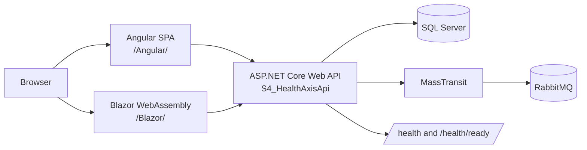
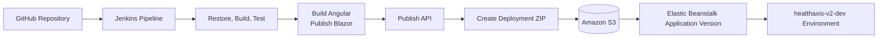
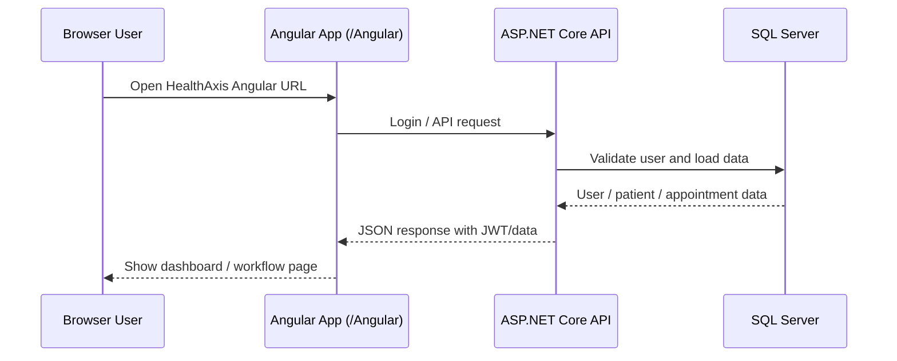
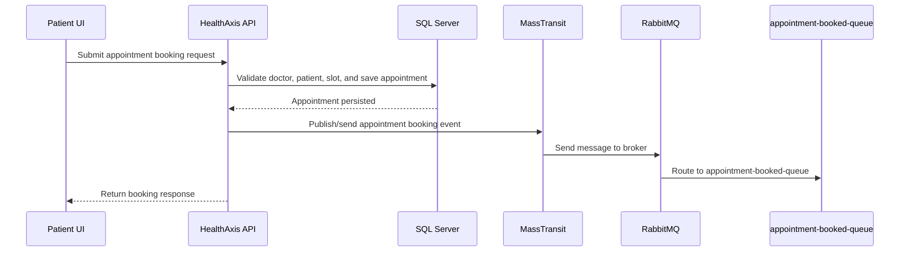
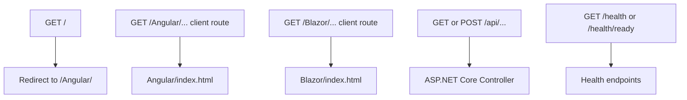
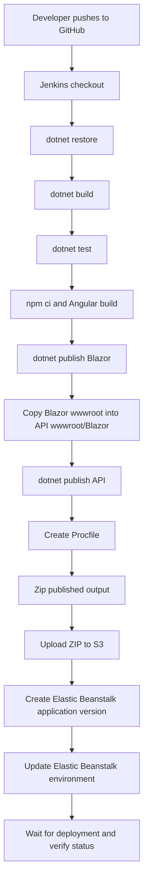

# HealthAxis


HealthAxis is a clinic and appointment management system I built to get hands-on with a "real" full-stack setup instead of another CRUD tutorial project. It's got an ASP.NET Core Web API on the backend, two separate frontends (Angular for patients/doctors, Blazor WebAssembly for admin stuff), SQL Server for persistence, RabbitMQ + MassTransit for the event side of things, and it's deployed to AWS through a Jenkins pipeline.

It's not a polished commercial product — think of it as a portfolio-grade project that's been pushed far enough to actually behave like production software: real auth, real deployment pipeline, real "why is readiness failing" debugging sessions.

---

## Live URLs

| Area | URL |
|---|---|
| Angular App | [http://healthaxis-v2-dev.eba-pbcv4if3.ap-south-1.elasticbeanstalk.com/Angular/](http://healthaxis-v2-dev.eba-pbcv4if3.ap-south-1.elasticbeanstalk.com/Angular/) |
| API Base URL | [http://healthaxis-v2-dev.eba-pbcv4if3.ap-south-1.elasticbeanstalk.com](http://healthaxis-v2-dev.eba-pbcv4if3.ap-south-1.elasticbeanstalk.com) |
| Health Check | [http://healthaxis-v2-dev.eba-pbcv4if3.ap-south-1.elasticbeanstalk.com/health](http://healthaxis-v2-dev.eba-pbcv4if3.ap-south-1.elasticbeanstalk.com/health) |
| Readiness Check | [http://healthaxis-v2-dev.eba-pbcv4if3.ap-south-1.elasticbeanstalk.com/health/ready](http://healthaxis-v2-dev.eba-pbcv4if3.ap-south-1.elasticbeanstalk.com/health/ready) |

This is the dev environment, so don't expect five-nines uptime — I redeploy it fairly often while I'm working through Sprint 4 hardening.

---

## Screenshots

I still need to actually take and drop these in. Folder for them is:

```text
docs/screenshots/
```

Planned screenshots (filenames below are what the README links expect, so keep them named this way when you add them):

```text
docs/screenshots/healthaxis-landing.png
docs/screenshots/angular-login.png
docs/screenshots/angular-register.png
docs/screenshots/patient-dashboard.png
docs/screenshots/patient-appointments.png
docs/screenshots/patient-history.png
docs/screenshots/doctor-dashboard.png
docs/screenshots/blazor-admin.png
```

### Landing Page


### Login Page


### Registration Page


### Patient Dashboard


### Patient Appointments


### Patient History


### Doctor Dashboard


### Blazor Admin Workflow


(Placeholders are fine for now — just don't rename the files without updating the links above.)

---

## Table of Contents

- [Why This Exists](#why-this-exists)
- [What It Actually Does](#what-it-actually-does)
- [Architecture](#architecture)
- [How a Request Flows Through the App](#how-a-request-flows-through-the-app)
- [Appointment Booking → RabbitMQ](#appointment-booking--rabbitmq)
- [How Angular/Blazor Get Served](#how-angularblazor-get-served)
- [CI/CD Pipeline Flow](#cicd-pipeline-flow)
- [Repo Layout](#repo-layout)
- [Tech Stack](#tech-stack)
- [Before You Start](#before-you-start)
- [Getting It Running Locally](#getting-it-running-locally)
- [Database Setup](#database-setup)
- [Environment Variables](#environment-variables)
- [Running the Tests](#running-the-tests)
- [Build & Publish](#build--publish)
- [Static Hosting Notes](#static-hosting-notes)
- [AWS Elastic Beanstalk Notes](#aws-elastic-beanstalk-notes)
- [Jenkins Pipeline](#jenkins-pipeline)
- [A Few API Endpoints](#a-few-api-endpoints)
- [Troubleshooting](#troubleshooting)
- [Security Notes](#security-notes)
- [What's Left / Ideas](#whats-left--ideas)
- [Things You'll Need to Change for Your Own Fork](#things-youll-need-to-change-for-your-own-fork)
- [License](#license)

---

## Why This Exists

Clinics still run a lot of scheduling by phone calls, sticky notes, and shared spreadsheets. That's fine at small scale, but it falls apart fast once you've got multiple doctors, overlapping schedules, and patients who need to see their own history. I wanted to build something that handles:

- Patient registration and login
- Doctor and patient dashboards that don't feel like an afterthought
- Appointment booking that's actually validated server-side (slot, doctor, patient)
- Appointment history per patient
- Doctor schedules
- Health record association tied to appointments
- An admin surface that's architecturally separate from the patient-facing app (hence Blazor living on its own)
- Everything backed by SQL Server, with appointment events flowing through RabbitMQ instead of being handled inline

## What It Actually Does

**Auth**
JWT-based login, role-based authorization, protected endpoints behind bearer tokens.

**Patients**
Registration, login, dashboard, profile lookup, appointment history, browsing doctors and booking a slot.

**Doctors**
Doctor-facing views and schedule handling through the Angular app.

**Appointments**
Booking, per-patient history, doctor/patient association, and an event published to RabbitMQ once a booking is confirmed.

**Health records**
Tied to appointments, surfaced through the patient history views.

**Admin (Blazor)**
A separate WebAssembly app under `/Blazor/` for admin-side workflows — kept apart from the Angular app on purpose so the two frontends don't end up tangled together.

**Messaging**
RabbitMQ + MassTransit. Appointment bookings publish to `appointment-booked-queue`.

**Health checks**
`/health` for liveness, `/health/ready` for actually checking SQL Server and RabbitMQ are reachable — this one caught a real infra bug for me, more on that below.

**Deployment**
AWS Elastic Beanstalk, deployment bundles staged through S3, Jenkins doing the build/test/deploy.

---

## Architecture



And roughly how a deploy moves:



One thing worth calling out: the API project (`S4_HealthAxisApi`) is also what serves the two frontends. Rather than standing up separate static hosting, the Angular build output and the Blazor publish output both get copied into the API's `wwwroot` and served from there:

```text
/Angular/ -> Angular frontend
/Blazor/  -> Blazor WebAssembly frontend
/api/...  -> ASP.NET Core Web API endpoints
/health   -> liveness endpoint
/health/ready -> readiness endpoint
```

Not the "correct" microservices way of doing it, but it means one Elastic Beanstalk environment covers everything, which was the right tradeoff for this project's scale.

## How a Request Flows Through the App



## Appointment Booking → RabbitMQ



The booking itself is validated and saved synchronously — the message publish happens after the DB write succeeds, not before, so a broker hiccup doesn't block a patient from booking.

## How Angular/Blazor Get Served



Both SPAs need fallback routes registered in the API, or refreshing on a client-side route (like `/Angular/dashboard`) 404s:

```csharp
app.MapFallbackToFile("/Angular/{*path:nonfile}", "Angular/index.html");
app.MapFallbackToFile("/Blazor/{*path:nonfile}", "Blazor/index.html");
```

## CI/CD Pipeline Flow



---

## Repo Layout

```text
HealthAxis/
│
├── S4_HealthAxis.slnx
│   Main solution file.
│
├── S4_HealthAxisApi/
│   The API project — also doubles as the deployment host. Controllers,
│   auth, EF Core, MassTransit/RabbitMQ wiring, health checks, and the
│   static frontend hosting all live here.
│
│   └── wwwroot/
│       ├── Angular/   <- Angular production build output, served at /Angular/
│       └── Blazor/    <- Blazor WASM publish output, served at /Blazor/
│
├── S4_HealthAxis.Angular/
│   Angular frontend — landing, login, registration, patient/doctor
│   dashboards, appointment booking and history.
│
├── S4_HealthAxis.Blazor/
│   Blazor WebAssembly frontend for the admin-side workflows.
│
├── S4_HealthAxis.Shared/
│   Shared DTOs and contracts used across the API and both frontends.
│
├── S4_HealthAxis.Tests/
│   Automated test project.
│
├── docs/
│   Docs and screenshots.
│
└── Jenkinsfile
    CI/CD pipeline definition.
```

## Tech Stack

**Backend** — .NET 10, ASP.NET Core Web API, EF Core, SQL Server, JWT auth, role-based authorization, Serilog, global exception handling, health/readiness endpoints.

**Frontend** — Angular + TypeScript + Bootstrap/Bootstrap Icons, Blazor WebAssembly for admin.

**Messaging** — RabbitMQ, MassTransit, `appointment-booked-queue`.

**Cloud/DevOps** — AWS Elastic Beanstalk (Linux, NGINX reverse proxy in front of Kestrel), S3 for deployment bundles, Jenkins, GitHub.

**Testing** — `S4_HealthAxis.Tests`, run via `dotnet test`.

---

## Before You Start

You'll need:

- .NET 10 SDK
- Node.js + npm
- SQL Server
- RabbitMQ
- Git
- AWS CLI (only if you're deploying manually)
- Jenkins (only if you're running the pipeline yourself)

Quick sanity check:

```powershell
dotnet --info
node --version
npm --version
git --version
aws --version
```

## Getting It Running Locally

**1. Clone it**

```powershell
git clone https://github.com/<your-user-or-org>/<your-repo>.git
cd <your-repo>
```

(swap in the actual repo URL)

**2. Restore the .NET side**

```powershell
dotnet restore .\S4_HealthAxis.slnx
```

**3. Install Angular deps**

```powershell
cd .\S4_HealthAxis.Angular
npm ci
cd ..
```

**4. Set your local config**

Pick one: `appsettings.Development.json`, .NET user secrets, or environment variables. You'll need values for:

```text
ConnectionStrings:Default
JwtSettings
RabbitMq
Cors
ElasticSearch
```

Don't commit real secrets into any of these.

**5. Make sure SQL Server and RabbitMQ are actually reachable**

The AWS-deployed environment talks to both at:

```text
SQL Server: 10.20.13.213:1433
RabbitMQ:   10.20.13.213:5672
```

Locally, just point at your own SQL Server/RabbitMQ instances (or tunnel into the AWS ones if that's your setup).

**6. Apply migrations**

Install the EF tool if you don't have it:

```powershell
dotnet tool install --global dotnet-ef
```

Then:

```powershell
dotnet ef database update --project .\S4_HealthAxisApi\S4_HealthAxisApi.csproj
```

If your migrations live somewhere else, or the solution needs an explicit startup project, adjust accordingly.

**7. Build**

```powershell
dotnet build .\S4_HealthAxis.slnx -c Release
```

**8. Run the tests** (worth doing before you assume anything works)

```powershell
dotnet test .\S4_HealthAxis.slnx -c Release
```

**9. Run the API**

```powershell
dotnet run --project .\S4_HealthAxisApi\S4_HealthAxisApi.csproj
```

**10. Build the Angular static output**

```powershell
cd .\S4_HealthAxis.Angular
npm run build
cd ..
```

Output should land in:

```text
S4_HealthAxisApi\wwwroot\Angular
```

**11. Publish Blazor and copy it into the API's wwwroot**

```powershell
Remove-Item .\blazor-publish-temp -Recurse -Force -ErrorAction SilentlyContinue
Remove-Item .\S4_HealthAxisApi\wwwroot\Blazor -Recurse -Force -ErrorAction SilentlyContinue

dotnet publish .\S4_HealthAxis.Blazor\S4_HealthAxis.Blazor.csproj `
  -c Release `
  -o .\blazor-publish-temp

New-Item -ItemType Directory -Path .\S4_HealthAxisApi\wwwroot\Blazor -Force

Copy-Item .\blazor-publish-temp\wwwroot\* `
  .\S4_HealthAxisApi\wwwroot\Blazor `
  -Recurse `
  -Force
```

Sanity check (both should say `True`):

```powershell
Test-Path .\S4_HealthAxisApi\wwwroot\Blazor\index.html
Test-Path .\S4_HealthAxisApi\wwwroot\Blazor\_framework
```

**12. Hit it locally**

```text
/Angular/
/Blazor/
/api/...
/health
/health/ready
```

---

## Database Setup

EF Core against SQL Server. The connection string key is:

```text
ConnectionStrings__Default
```

which maps to `ConnectionStrings:Default` in config.

Migration command:

```powershell
dotnet ef database update --project .\S4_HealthAxisApi\S4_HealthAxisApi.csproj
```

If you're using a separate migrations assembly or need to specify a startup project explicitly:

```powershell
dotnet ef database update `
  --project .\S4_HealthAxisApi\S4_HealthAxisApi.csproj `
  --startup-project .\S4_HealthAxisApi\S4_HealthAxisApi.csproj
```

---

## Environment Variables

Don't commit any of these with real values. Use user secrets locally, Jenkins credentials for CI, and Elastic Beanstalk environment properties (or a proper secret store) for the deployed environment.

| Name | What it's for | Example |
|---|---|---|
| `ASPNETCORE_ENVIRONMENT` | Runtime environment | `Production` |
| `ASPNETCORE_URLS` | Listening URL behind EB/NGINX | `http://+:5000` |
| `ConnectionStrings__Default` | SQL Server connection string | `Server=10.20.13.213,1433;Database=HealthAxisDb;User Id=healthaxis_app;Password=<password>;Encrypt=True;TrustServerCertificate=True;Connect Timeout=30;MultipleActiveResultSets=True;` |
| `JwtSettings__Secret` | JWT signing secret | `<long-random-secret>` |
| `JwtSettings__Issuer` | JWT issuer | `HealthAxis` |
| `JwtSettings__Audience` | JWT audience | `HealthAxisUsers` |
| `RabbitMq__Host` | RabbitMQ host/private IP | `10.20.13.213` |
| `RabbitMq__Port` | RabbitMQ AMQP port | `5672` |
| `RabbitMq__Username` | RabbitMQ user | `<rabbitmq-user>` |
| `RabbitMq__Password` | RabbitMQ password | `<rabbitmq-password>` |
| `RabbitMq__VirtualHost` | RabbitMQ vhost | `/` |
| `RabbitMq__UseSsl` | Toggle RabbitMQ SSL | `false` |
| `RabbitMq__AppointmentQueue` | Appointment events queue | `appointment-booked-queue` |
| `Cors__AllowedOrigins__0` | Allowed browser origin | `http://healthaxis-v2-dev.eba-pbcv4if3.ap-south-1.elasticbeanstalk.com` |
| `ElasticSearch__Enabled` | Toggle Elasticsearch integration | `false` |

---

## Running the Tests

Test project: `S4_HealthAxis.Tests`

Last full run: **355 tests passed**.

```powershell
dotnet test .\S4_HealthAxis.slnx -c Release
```

---

## Build & Publish

```powershell
# restore
dotnet restore .\S4_HealthAxis.slnx

# build
dotnet build .\S4_HealthAxis.slnx -c Release --no-restore

# test
dotnet test .\S4_HealthAxis.slnx -c Release --no-build

# Angular
cd .\S4_HealthAxis.Angular
npm ci
npm run build
cd ..
```

Publish Blazor and copy its output into the API:

```powershell
Remove-Item .\blazor-publish-temp -Recurse -Force -ErrorAction SilentlyContinue
Remove-Item .\S4_HealthAxisApi\wwwroot\Blazor -Recurse -Force -ErrorAction SilentlyContinue

dotnet publish .\S4_HealthAxis.Blazor\S4_HealthAxis.Blazor.csproj `
  -c Release `
  -o .\blazor-publish-temp

New-Item -ItemType Directory -Path .\S4_HealthAxisApi\wwwroot\Blazor -Force

Copy-Item .\blazor-publish-temp\wwwroot\* `
  .\S4_HealthAxisApi\wwwroot\Blazor `
  -Recurse `
  -Force
```

Publish the API:

```powershell
dotnet publish .\S4_HealthAxisApi\S4_HealthAxisApi.csproj `
  -c Release `
  -o .\publish
```

Self-contained Linux build, if you need it:

```powershell
dotnet publish .\S4_HealthAxisApi\S4_HealthAxisApi.csproj `
  -c Release `
  -r linux-x64 `
  --self-contained true `
  -o .\publish
```

---

## Static Hosting Notes

The API hosts both frontends out of `wwwroot`:

```text
/          -> redirects to /Angular/
/Angular/ -> Angular frontend
/Blazor/  -> Blazor WebAssembly frontend
```

Fallback routes need to exist in `S4_HealthAxisApi/Program.cs`:

```csharp
app.MapFallbackToFile("/Angular/{*path:nonfile}", "Angular/index.html");
app.MapFallbackToFile("/Blazor/{*path:nonfile}", "Blazor/index.html");
```

Blazor needs its base href set correctly:

```html
<base href="/Blazor/" />
```

(in `S4_HealthAxis.Blazor/wwwroot/index.html`)

Correct output layout:

```text
S4_HealthAxisApi/wwwroot/Blazor/index.html
S4_HealthAxisApi/wwwroot/Blazor/_framework
```

Not this (easy mistake if you forget the `wwwroot/*` glob when copying):

```text
S4_HealthAxisApi/wwwroot/Blazor/wwwroot/index.html
```

---

## AWS Elastic Beanstalk Notes

**Current environment:**

```text
AWS region: ap-south-1
EB application: healthaxis-v2
EB environment: healthaxis-v2-dev
EB URL: http://healthaxis-v2-dev.eba-pbcv4if3.ap-south-1.elasticbeanstalk.com
S3 bucket: healthaxis-db-script-bucket
```

**Networking**

The API needs to reach:

```text
SQL Server: 10.20.13.213:1433
RabbitMQ:   10.20.13.213:5672
```

which means Elastic Beanstalk either needs to be in the same VPC as those, or have proper peering/route tables/NACLs/security groups set up if it isn't.

I actually hit this: I originally stood up the EB environment in the wrong VPC. The app deployed fine and `/health` was green, but `/health/ready` kept failing because it genuinely couldn't reach RabbitMQ or SQL Server over the private IP — the instance just had no route there. Recreating the environment in the correct VPC fixed it immediately. If you're seeing the same split (liveness fine, readiness failing), check VPC placement before you touch anything else.

**Security groups**

- Allow TCP 1433 from the EB security group → SQL Server security group
- Allow TCP 5672 from the EB security group → RabbitMQ security group
- Neither SQL Server nor RabbitMQ should be publicly reachable

**Procfile**

Framework-dependent:

```text
web: dotnet S4_HealthAxisApi.dll
```

Self-contained:

```text
web: ./S4_HealthAxisApi
```

Match whichever one your published bundle actually is.

---

## Jenkins Pipeline

Runs on a Windows agent. Steps, roughly in order:

1. Checkout from GitHub
2. `dotnet restore`
3. `dotnet build`
4. `dotnet test`
5. Build Angular
6. Publish Blazor
7. Copy Blazor `wwwroot` into `S4_HealthAxisApi/wwwroot/Blazor`
8. Publish the API
9. Generate the `Procfile`
10. Zip the published output
11. Upload to S3
12. Create an EB application version
13. Update the EB environment
14. Wait for the deploy to finish, print status

AWS credentials are stored in Jenkins Credentials — nothing hardcoded in the repo.

```text
AWS_REGION=ap-south-1
EB_APPLICATION_NAME=healthaxis-v2
EB_ENVIRONMENT_NAME=healthaxis-v2-dev
S3_BUCKET=healthaxis-db-script-bucket
```

---

## A Few API Endpoints

Not a full spec, just enough to get oriented:

| Method | Endpoint | What it does |
|---|---|---|
| `POST` | `/api/auth/login` | Authenticates a user, returns auth data |
| `GET` | `/api/patients/{id}` | Gets a patient by ID |
| `GET` | `/api/appointments/patient/{patientId}` | Gets appointment history for a patient |
| `GET` | `/health` | Liveness check |
| `GET` | `/health/ready` | Readiness check (SQL Server + RabbitMQ reachability) |

---

## Troubleshooting

**`/health` is fine but `/health/ready` fails**

Usually one of:
- SQL Server unreachable
- RabbitMQ unreachable
- EB is in the wrong VPC (see the AWS notes above — this got me once already)
- Missing security group rules
- Bad env var values

Check `ConnectionStrings__Default`, `RabbitMq__Host`, `RabbitMq__Port`, security group inbound rules, and VPC/subnet placement.

**RabbitMQ unreachable**

Symptoms look like:

```text
Broker unreachable
Connection failed, host 10.20.13.213:5672
```

Check that RabbitMQ is actually running, port 5672 is listening, `RabbitMq__Host`/`RabbitMq__Port` are correct, EB can route to that private IP, and the RabbitMQ security group allows inbound 5672 from EB.

**CORS blows up at startup**

Check `Cors__AllowedOrigins__0`. It should look exactly like:

```text
http://healthaxis-v2-dev.eba-pbcv4if3.ap-south-1.elasticbeanstalk.com
```

No quotes, no trailing comma, no trailing slash, and don't append `/Angular` or `/Blazor` to it.

**`/Blazor/login` 404s**

Check that:
- The Blazor fallback route is actually in `Program.cs`
- `S4_HealthAxisApi/wwwroot/Blazor/index.html` and `_framework` exist
- `index.html` has `base href="/Blazor/"`
- Output isn't nested under `wwwroot/Blazor/wwwroot`

**Angular build budget failures in CI**

Look at `S4_HealthAxis.Angular/angular.json`. Bump the budget thresholds if it's warranted, or trim oversized component CSS — just don't do it blindly, make it a deliberate change.

**EB in the wrong VPC**

If EB can't reach `10.20.13.213` for SQL Server/RabbitMQ, check which VPC the EB EC2 instance actually landed in. Easiest fix is usually to recreate the environment in the right VPC rather than trying to retrofit peering after the fact.

---

## Security Notes

- No secrets in the repo — not DB passwords, RabbitMQ credentials, JWT secrets, or AWS keys
- AWS credentials live in Jenkins Credentials
- Production config lives in EB environment properties (or should eventually move to a proper secret store)
- SQL Server and RabbitMQ inbound rules are restricted to the EB security group
- Neither DB nor broker port should ever be publicly exposed
- Rotate anything that accidentally ends up in logs, screenshots, or chat history
- Still need HTTPS + a real domain before this goes anywhere near production

---

## What's Left / Ideas

- Move secrets to AWS Secrets Manager or SSM Parameter Store
- HTTPS + custom domain
- Automate migrations as part of CI/CD instead of running them by hand
- Blue/green deployments
- Actual observability dashboards instead of tailing logs
- Structured alerting
- Docker, eventually
- Managed RabbitMQ (Amazon MQ) instead of self-hosted, if this ever needs to be "real"
- More admin workflows in the Blazor app
- Generated API docs
- End-to-end UI tests
- Mobile responsiveness pass across the frontend — it's usable but not great on small screens

---

## Things You'll Need to Change for Your Own Fork

| Item | Current value | Change it when... |
|---|---|---|
| GitHub clone URL | `https://github.com/<your-user-or-org>/<your-repo>.git` | you're not me |
| Angular URL | `http://healthaxis-v2-dev.eba-pbcv4if3.ap-south-1.elasticbeanstalk.com/Angular/` | the EB CNAME or domain changes |
| API base URL | `http://healthaxis-v2-dev.eba-pbcv4if3.ap-south-1.elasticbeanstalk.com` | same as above |
| S3 bucket | `healthaxis-db-script-bucket` | Jenkins deploys somewhere else |
| EB application name | `healthaxis-v2` | it's renamed |
| EB environment name | `healthaxis-v2-dev` | deploying to staging/prod |
| SQL/RabbitMQ private IP | `10.20.13.213` | infra moves |
| Screenshot paths | `docs/screenshots/*.png` | you actually add the screenshots |
| Procfile command | `dotnet S4_HealthAxisApi.dll` or `./S4_HealthAxisApi` | depends on framework-dependent vs self-contained publish |

---

## License

This is a learning/portfolio project unless stated otherwise. No formal license file yet — add one before reusing this for anything beyond that.

```text
Copyright (c) 2026.
All rights reserved unless a LICENSE file states otherwise.
```